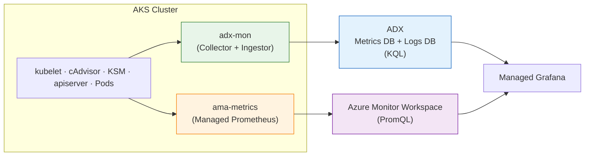

# adx-mon vs Managed Prometheus

A side-by-side comparison for teams choosing between [adx-mon](https://github.com/Azure/adx-mon) and [Azure Managed Prometheus](https://learn.microsoft.com/en-us/azure/azure-monitor/essentials/prometheus-metrics-overview) on AKS. This repo deploys both systems with a single Bicep command — see [README.md](README.md) for setup.

> **TL;DR** — Both collect the same core Kubernetes metrics. adx-mon adds logs and KQL analytics in one store. Managed Prometheus adds turnkey dashboards, alerts, and zero operational overhead. They can run side-by-side.

---

## Architecture

Both systems scrape the same Prometheus endpoints. adx-mon stores data in [Azure Data Explorer](https://learn.microsoft.com/en-us/azure/data-explorer/) (KQL). Managed Prometheus stores data in an [Azure Monitor Workspace](https://learn.microsoft.com/en-us/azure/azure-monitor/essentials/azure-monitor-workspace-overview) (PromQL).

---

## Metrics Coverage

Where both systems collect the same metric, the underlying data is identical — it comes from the same exporters.

| Category | adx-mon | Managed Prometheus | Notes |
|----------|---------|-------------------|-------|
| **Container CPU / memory** | ✅ [cAdvisor](https://github.com/google/cadvisor) | ✅ cAdvisor | Same metrics: `container_cpu_usage_seconds_total`, `container_memory_working_set_bytes`, etc. |
| **Container network / filesystem** | ✅ cAdvisor | ✅ cAdvisor | Same metrics |
| **Kubelet health** | ✅ kubelet `/metrics/resource` | ✅ kubelet | Volume stats, runtime ops, pod start latency |
| **Kubernetes object state** | ✅ [KSM](https://github.com/kubernetes/kube-state-metrics) (deployed) | ✅ KSM (deployed) | Pod phase, deployment replicas, node conditions, etc. |
| **kube-apiserver** | ✅ Collector Singleton | ⚠️ [Preview](https://learn.microsoft.com/en-us/azure/aks/control-plane-metrics-monitor) | adx-mon scrapes directly; MP requires enabling Control Plane Metrics (preview) |
| **Node-level (disk, load, network)** | ❌ Not collected | ✅ [node-exporter](https://github.com/prometheus/node_exporter) | Biggest gap — adx-mon lacks `node_load*`, `node_disk_*`, `node_filesystem_*`. Mitigated by deploying node-exporter with `adx-mon/scrape: "true"` ([details](README.md#metrics-pod-annotations)) |
| **Application metrics** | ✅ Pod annotations | ⚠️ [Custom ConfigMap](https://learn.microsoft.com/en-us/azure/azure-monitor/containers/prometheus-metrics-scrape-configuration) | adx-mon: annotate pods. MP: edit `ama-metrics-settings-configmap` |

---

## Logs

Managed Prometheus **does not collect logs** — it's metrics-only. For logs you need a separate service ([Container Insights](https://learn.microsoft.com/en-us/azure/azure-monitor/containers/container-insights-overview), [Log Analytics](https://learn.microsoft.com/en-us/azure/azure-monitor/logs/log-analytics-overview)).

| Capability | adx-mon | Managed Prometheus |
|-----------|---------|-------------------|
| **Container logs** | ✅ Via pod annotation → dedicated ADX table | ❌ Requires Container Insights |
| **Kubelet journal** | ✅ Systemd journal → ADX `Kubelet` table | ❌ Requires Container Insights |
| **Control plane logs** | ❌ Azure resource logs — use [Diagnostic Settings](https://learn.microsoft.com/en-us/azure/aks/monitor-aks#azure-monitor-resource-logs) | ❌ Same |
| **Metric + log correlation** | ✅ Single KQL query across both | ❌ Separate systems |

adx-mon's key advantage: metrics and logs in the **same ADX cluster**, queryable with one KQL statement.

---

## Alerting & Dashboards

| Capability | adx-mon | Managed Prometheus |
|-----------|---------|-------------------|
| **OOTB alerts** | ❌ Sample only (pod restarts) | ✅ [Recommended Prometheus alert rules](https://learn.microsoft.com/en-us/azure/azure-monitor/containers/kubernetes-metric-alerts) |
| **OOTB dashboards** | ⚠️ Bundled demo dashboard; more via JSON import | ✅ [16 auto-provisioned Grafana dashboards](https://learn.microsoft.com/en-us/azure/azure-monitor/containers/prometheus-metrics-scrape-default#dashboards) |
| **Alert language** | KQL ([AlertRule CRD](https://github.com/Azure/adx-mon)) | PromQL ([Prometheus Rule Groups](https://learn.microsoft.com/en-us/azure/azure-monitor/alerts/prometheus-alerts)) |
| **Cross-signal alerts** | ✅ Join metrics + logs in one query | ❌ Metrics only |
| **Action Groups** | ⚠️ Custom integration needed | ✅ [Native Azure Action Groups](https://learn.microsoft.com/en-us/azure/azure-monitor/alerts/action-groups) |
| **Anomaly detection** | ✅ KQL built-in ML ([`series_decompose_anomalies`](https://learn.microsoft.com/en-us/kusto/query/series-decompose-anomalies-function)) | ❌ PromQL has no native ML |

---

## When to Use What

| Scenario | Recommendation |
|----------|---------------|
| Want turnkey dashboards & alerts, minimal ops | **Managed Prometheus** — auto-managed agents, auto-scaling, native Action Groups |
| Need metrics + logs in one place with KQL | **adx-mon** — single ADX cluster, KQL joins across both signals |
| Need long-term retention (>18 months) | **adx-mon** — ADX retention configurable from days to years (vs 18 months max) |
| Want cross-signal alerting (metrics + logs) | **adx-mon** — KQL with built-in ML ([`series_decompose_anomalies`](https://learn.microsoft.com/en-us/kusto/query/series-decompose-anomalies-function)) |
| Cost-sensitive with high-cardinality metrics | **adx-mon** — fixed ADX compute + storage vs [per-sample ingestion](https://azure.microsoft.com/en-us/pricing/details/monitor/) |
| Need OOTB community dashboards / PromQL ecosystem | **Managed Prometheus** — 16 auto-provisioned dashboards + PromQL |
| Want both | ✅ They coexist — set [`enableManagedPrometheus = true`](README.md#optional-managed-prometheus) |

**Operational note**: adx-mon requires manual agent updates and cluster sizing (Collector DaemonSet, Ingestor StatefulSet, KSM, 9 CRDs). Managed Prometheus auto-manages its [`ama-metrics`](https://learn.microsoft.com/en-us/azure/azure-monitor/containers/prometheus-metrics-enable) pods and scales transparently. Both support multi-cluster by pointing all clusters at one backend (ADX cluster or AMW). ADX uses KQL (joins, ML, time-series); AMW uses PromQL (aggregation, rates).
