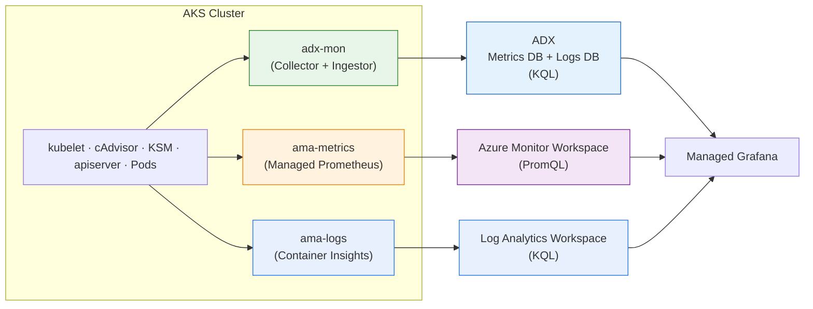

# adx-mon vs Managed Prometheus vs Container Insights

A side-by-side comparison for teams choosing between [adx-mon](https://github.com/Azure/adx-mon), [Azure Managed Prometheus](https://learn.microsoft.com/en-us/azure/azure-monitor/essentials/prometheus-metrics-overview), and [Container Insights](https://learn.microsoft.com/en-us/azure/azure-monitor/containers/container-insights-overview) on AKS. This repo deploys all three with a single Bicep command — see [README.md](README.md) for setup.

> **TL;DR** — adx-mon captures metrics + logs in ADX with KQL. Managed Prometheus adds turnkey dashboards and alerts for metrics. Container Insights adds wildcard log capture and structured Kubernetes inventory. They all coexist.

---

## Architecture

adx-mon stores data in [Azure Data Explorer](https://learn.microsoft.com/en-us/azure/data-explorer/) (KQL). Managed Prometheus stores metrics in an [Azure Monitor Workspace](https://learn.microsoft.com/en-us/azure/azure-monitor/essentials/azure-monitor-workspace-overview) (PromQL). Container Insights stores logs and inventory in a [Log Analytics Workspace](https://learn.microsoft.com/en-us/azure/azure-monitor/logs/log-analytics-overview) (KQL).

---

## Metrics Coverage

Where both systems collect the same metric, the underlying data is identical — it comes from the same exporters.

| Category | adx-mon | Managed Prometheus | Notes |
|----------|---------|-------------------|-------|
| **Container CPU / memory** | ✅ [cAdvisor](https://github.com/google/cadvisor) | ✅ cAdvisor | Same metrics: `container_cpu_usage_seconds_total`, `container_memory_working_set_bytes`, etc. |
| **Container network / filesystem** | ✅ cAdvisor | ✅ cAdvisor | Same metrics |
| **Kubelet health** | ✅ kubelet `/metrics/resource` | ✅ kubelet | Volume stats, runtime ops, pod start latency |
| **Kubernetes object state** | ✅ [KSM](https://github.com/kubernetes/kube-state-metrics) (deployed) | ✅ KSM (deployed) | Pod phase, deployment replicas, node conditions, etc. |
| **kube-apiserver** | ✅ Collector Singleton | ⚠️ [Preview](https://learn.microsoft.com/en-us/azure/aks/control-plane-metrics-monitor) | adx-mon scrapes directly; MP requires enabling Control Plane Metrics (preview) |
| **Node-level (disk, load, network)** | ❌ Not collected | ✅ [node-exporter](https://github.com/prometheus/node_exporter) | Biggest gap — adx-mon lacks `node_load*`, `node_disk_*`, `node_filesystem_*`. Mitigated by deploying node-exporter with `adx-mon/scrape: "true"` ([details](README.md#metrics-pod-annotations)) |
| **Application metrics** | ✅ Pod annotations | ✅ Pod annotations (enabled by default via [`enableFullPrometheusMetrics`](README.md#managed-prometheus-enabled-by-default)) | adx-mon: annotate pods. MP: same annotations scraped automatically |

---

## Logs

Managed Prometheus **does not collect logs** — it's metrics-only. Container Insights is the Azure-managed log pipeline — the log equivalent of what Managed Prometheus is for metrics.

| Capability | adx-mon | Managed Prometheus | Container Insights |
|-----------|---------|-------------------|-------------------|
| **Container logs** | ✅ Via pod annotation → dedicated ADX table | ❌ | ✅ `ContainerLogV2` — all containers, auto-discovered |
| **Kubelet journal** | ✅ Systemd journal → ADX `Kubelet` table | ❌ | ❌ |
| **Control plane logs** | ❌ Use [Diagnostic Settings](README.md#aks-diagnostic-settings-enabled-by-default) | ❌ | ❌ Use Diagnostic Settings |
| **Kubernetes inventory** | ⚠️ KSM metrics only (time-series, not snapshots) | ❌ | ✅ `KubePodInventory`, `KubeEvents`, `KubeNodeInventory` |
| **Metric + log correlation** | ✅ Single KQL query across both | ❌ | ⚠️ Separate workspace from metrics |
| **Wildcard log capture** | ❌ Requires per-pod annotation | ❌ | ✅ All pods captured by default |

**Key distinction**: adx-mon requires `adx-mon/scrape: "true"` annotation per pod. Container Insights auto-discovers all containers — deploy a pod and logs appear immediately.

---

## Alerting & Dashboards

| Capability | adx-mon | Managed Prometheus |
|-----------|---------|-------------------|
| **OOTB alerts** | ❌ Sample only (pod restarts) | ✅ [Recommended Prometheus alert rules](https://learn.microsoft.com/en-us/azure/azure-monitor/containers/kubernetes-metric-alerts) |
| **OOTB dashboards** | ⚠️ Bundled demo dashboard; more via JSON import | ✅ [Auto-provisioned Grafana dashboards](https://learn.microsoft.com/en-us/azure/azure-monitor/containers/prometheus-metrics-scrape-default#dashboards) (45+ Kubernetes/Azure dashboards) |
| **Alert language** | KQL ([AlertRule CRD](https://github.com/Azure/adx-mon)) | PromQL ([Prometheus Rule Groups](https://learn.microsoft.com/en-us/azure/azure-monitor/alerts/prometheus-alerts)) |
| **Cross-signal alerts** | ✅ Join metrics + logs in one query | ❌ Metrics only |
| **Action Groups** | ⚠️ Custom integration needed | ✅ [Native Azure Action Groups](https://learn.microsoft.com/en-us/azure/azure-monitor/alerts/action-groups) |
| **Anomaly detection** | ✅ KQL built-in ML ([`series_decompose_anomalies`](https://learn.microsoft.com/en-us/kusto/query/series-decompose-anomalies-function)) | ❌ PromQL has no native ML |

---

## When to Use What

| Scenario | Recommendation |
|----------|---------------|
| Want turnkey dashboards & alerts, minimal ops | **Managed Prometheus** — auto-managed agents, auto-scaling, native Action Groups |
| Need metrics + logs in one place with KQL | **adx-mon** — single ADX cluster, KQL joins across both signals |
| Need auto-discovery of all container logs | **Container Insights** — no annotations needed, captures every pod |
| Need structured K8s inventory (pod phase, events) | **Container Insights** — `KubePodInventory`, `KubeEvents` have no adx-mon equivalent |
| Need long-term retention (>18 months) | **adx-mon** — ADX retention configurable from days to years (vs 18 months max) |
| Want cross-signal alerting (metrics + logs) | **adx-mon** — KQL with built-in ML ([`series_decompose_anomalies`](https://learn.microsoft.com/en-us/kusto/query/series-decompose-anomalies-function)) |
| Cost-sensitive with high-cardinality metrics | **adx-mon** — fixed ADX compute + storage vs [per-sample ingestion](https://azure.microsoft.com/en-us/pricing/details/monitor/) |
| Need OOTB community dashboards / PromQL ecosystem | **Managed Prometheus** — 45+ auto-provisioned dashboards + PromQL |
| Want all three | ✅ They coexist out of the box — all three are [enabled by default](README.md#managed-prometheus-enabled-by-default) |

**Operational note**: adx-mon requires manual agent updates and cluster sizing (Collector DaemonSet, Ingestor StatefulSet, KSM, 9 CRDs). Managed Prometheus and Container Insights auto-manage their agents ([`ama-metrics`](https://learn.microsoft.com/en-us/azure/azure-monitor/containers/prometheus-metrics-enable), [`ama-logs`](https://learn.microsoft.com/en-us/azure/azure-monitor/containers/container-insights-overview)) and scale transparently. ADX uses KQL (joins, ML, time-series); AMW uses PromQL (aggregation, rates); LAW uses KQL.
