# Monitoring Comparison: adx-mon vs Azure Managed Services

> **Purpose:** Evaluate whether adx-mon provides equivalent (or better) platform health and resource health monitoring compared to Azure's managed monitoring services (Managed Prometheus, Container Insights, Log Analytics) for AKS clusters.

---

## Table of Contents

### Part 1 — Metrics
- [Metrics Architecture Overview](#metrics-architecture-overview)
- [What We Deploy Today (adx-mon)](#what-we-deploy-today-adx-mon)
- [What Managed Prometheus Provides](#what-managed-prometheus-provides)
- [Side-by-Side Metrics Comparison](#side-by-side-metrics-comparison)
- [Why Not Just Use Managed Prometheus?](#why-not-just-use-managed-prometheus)
- [Gaps in adx-mon vs Managed Prometheus](#gaps-in-adx-mon-vs-managed-prometheus)
- [Metrics Conclusion](#metrics-conclusion)

### Part 2 — Logs
- [Logs Architecture Overview](#logs-architecture-overview)
- [The AKS Logging Landscape](#the-aks-logging-landscape)
- [How Logs Are Captured](#how-logs-are-captured)
- [Where Logs Land: The Azure Logging Taxonomy](#where-logs-land-the-azure-logging-taxonomy)
- [adx-mon Log Collection (What We Have)](#adx-mon-log-collection-what-we-have)
- [Azure-Native Log Collection (Container Insights + Diagnostic Settings)](#azure-native-log-collection-container-insights--diagnostic-settings)
- [Side-by-Side Logs Comparison](#side-by-side-logs-comparison)
- [Logs Conclusion](#logs-conclusion)

### References
- [References](#references)

---

# Part 1 — Metrics

## Metrics Architecture Overview

Below is a simplified architecture diagram showing both approaches and the components involved, including the distinction between infrastructure and application metrics.

```mermaid
graph TB
    subgraph Azure["Azure Subscription"]
        subgraph AKS["AKS Cluster(s)"]
            subgraph Workloads["Workloads"]
                direction LR
                AppPods["Application Pods<br/><i>example: web-app</i><br/>• /metrics endpoint<br/>• Pod annotations"]
                SystemPods["System Workloads<br/><i>kube-system/*</i><br/>• coredns<br/>• kube-proxy"]
            end
            
            subgraph InfraSources["Infrastructure Metrics Sources"]
                direction LR
                Kubelet["kubelet<br/>• Container metrics (cAdvisor)<br/>• Node metrics"]
                KSM["kube-state-metrics<br/>• Pod/Deployment state<br/>• Node conditions"]
                APIServer["kube-apiserver<br/>• API request metrics<br/>• etcd stats"]
            end
            
            ADXMon["adx-mon Collectors<br/>• DaemonSet (infra)<br/>• Singleton (control plane)<br/>• Ingestor"]
            ManagedProm["Managed Prometheus<br/>• ama-metrics (infra)<br/>• Auto-configured"]
            
            AppPods -.->|"App metrics<br/>(via annotation)"| ADXMon
            SystemPods -.->|"App metrics<br/>(custom config)"| ManagedProm
            Kubelet -->|Infrastructure| ADXMon
            KSM -->|Infrastructure| ADXMon
            APIServer -->|Infrastructure| ADXMon
            Kubelet -->|Infrastructure| ManagedProm
            KSM -->|Infrastructure| ManagedProm
            APIServer -.->|"Infra (preview)"| ManagedProm
        end
        
        ADX["Azure Data Explorer<br/>• Metrics DB (KQL)<br/>• Logs DB<br/>• 365d retention"]
        AMW["Azure Monitor Workspace<br/>• Prometheus Store (PromQL)<br/>• 18-month retention"]
        
        Grafana["Managed Grafana<br/>• ADX datasource (adx-mon)<br/>• Azure Monitor datasource (Managed Prom)<br/>• Dashboards for both paths"]
        
        ADXMon --> ADX
        ManagedProm --> AMW
        ADX --> Grafana
        AMW --> Grafana
    end
    
    style Azure fill:#e1f5ff
    style AKS fill:#fff4e6
    style Workloads fill:#ffe6f0
    style InfraSources fill:#e6f3ff
    style AppPods fill:#fff0f5
    style SystemPods fill:#fff0f5
    style Kubelet fill:#e3f2fd
    style KSM fill:#e3f2fd
    style APIServer fill:#e3f2fd
    style ADXMon fill:#e8f5e9
    style ManagedProm fill:#fce4ec
    style ADX fill:#e3f2fd
    style AMW fill:#f3e5f5
    style Grafana fill:#fff9c4
```



### Infrastructure vs. Application Metrics

The diagram distinguishes between two types of metrics:

#### Infrastructure Metrics (Solid Lines)
These are **automatically collected** by both monitoring solutions and provide visibility into the Kubernetes platform itself:

| Metric Source | What It Monitors | adx-mon Collection | Managed Prometheus Collection |
|---------------|------------------|-------------------|-------------------------------|
| **kubelet (cAdvisor)** | Container CPU, memory, network, filesystem usage | ✅ DaemonSet scrape | ✅ ama-metrics DaemonSet |
| **kubelet (resource)** | Kubelet operations, volume stats, pod lifecycle | ✅ DaemonSet scrape | ✅ ama-metrics DaemonSet |
| **kube-state-metrics** | Pod/Deployment/Node state, conditions, resource requests/limits | ✅ Deployed & scraped | ✅ Deployed & scraped |
| **kube-apiserver** | API request rates, latencies, etcd stats | ✅ Singleton scrape | ⚠️ Preview feature (Control Plane Metrics) |

**Key Difference:** Both solutions automatically collect infrastructure metrics. Managed Prometheus requires enabling "Control Plane Metrics" (preview) for API server metrics, while adx-mon includes this by default.

#### Application Metrics (Dashed Lines)
These are **custom metrics** exposed by application workloads and must be explicitly configured:

| Example Workload | Namespace | Metric Endpoint | adx-mon Collection | Managed Prometheus Collection |
|------------------|-----------|-----------------|-------------------|-------------------------------|
| **web-app** (custom) | `default` | `/metrics` | ✅ Pod annotation: `adx-mon/scrape: "true"` | ⚠️ Requires custom scrape config in ConfigMap |
| **coredns** | `kube-system` | `:9153/metrics` | ✅ Pod annotation (if added) | ⚠️ Must enable `coredns` target (disabled by default) |
| **kube-proxy** | `kube-system` | `:10249/metrics` | ✅ Pod annotation (if added) | ⚠️ Must enable `kubeproxy` target (disabled by default) |

**Key Difference:**
- **adx-mon**: Application metrics are collected via simple pod annotations (`adx-mon/scrape: "true"`). Any pod with a `/metrics` endpoint can be auto-discovered.
- **Managed Prometheus**: Application metrics require editing the `ama-metrics-settings-configmap` to add custom scrape configurations. System workloads like `coredns` and `kube-proxy` must be explicitly enabled.

---

## What We Deploy Today (adx-mon)

Our current deployment (defined in the Bicep templates and K8s manifests in this repo) provisions the following:

| Component | What It Does |
|-----------|-------------|
| **AKS Cluster** | 2-node cluster (Standard_D4s_v3), OIDC + workload identity enabled |
| **Azure Data Explorer (ADX)** | Standard_E2ads_v5 cluster (2 instances), streaming ingestion enabled |
| **Metrics Database** | Auto-created tables (~600+), 365d retention, 31d hot cache |
| **Logs Database** | Kubelet, Collector, Ingestor, and app logs; 365d retention |
| **Collector DaemonSet** | Per-node: scrapes cAdvisor, kubelet, annotated pods, collects node logs |
| **Collector Singleton** | Scrapes kube-apiserver metrics |
| **kube-state-metrics** | 2-shard StatefulSet exporting K8s object state |
| **Ingestor** | StatefulSet that batches and writes to ADX |
| **Managed Grafana** | Standard SKU (v11) with pre-configured ADX datasource |
| **Workload Identity** | Federated credentials — zero secrets in the cluster |

### Metrics We Actively Collect

| Source | Collection Method | Example Metrics |
|--------|-------------------|-----------------|
| **cAdvisor** | Collector DaemonSet → kubelet :10250/metrics/cadvisor | `container_cpu_usage_seconds_total`, `container_memory_working_set_bytes`, `container_network_*`, `container_fs_*` |
| **Kubelet** | Collector DaemonSet → kubelet :10250/metrics/resource | `kubelet_running_pods`, `kubelet_volume_stats_*`, `kubelet_runtime_operations_*` |
| **kube-apiserver** | Collector Singleton → kubernetes.default.svc/metrics | `apiserver_request_total`, `apiserver_request_duration_seconds`, etcd cache stats |
| **kube-state-metrics** | Collector → KSM StatefulSet | `kube_pod_status_phase`, `kube_pod_container_status_restarts_total`, `kube_deployment_status_replicas`, `kube_node_status_condition`, `kube_node_info` |
| **Application metrics** | Pod annotation `adx-mon/scrape: "true"` | Any Prometheus-compatible `/metrics` endpoint |

### Logs We Actively Collect

| Log Source | Table in ADX |
|------------|-------------|
| Kubelet journal (systemd) | `Kubelet` |
| Collector component logs | `Collector` |
| Ingestor component logs | `Ingestor` |
| App container logs (via annotation) | User-defined tables |

### Alerting

- **AlertRule CRD** — define alerts in Kubernetes that run KQL queries on a schedule
- Example: pod restart detection (>3 restarts in 10 min window)
- Supports auto-mitigation (auto-resolve after configurable duration)
- **Cross-signal alerting** — because both metrics *and* logs live in ADX/Kusto, a single KQL query can correlate metrics with log events

---

## What Managed Prometheus Provides

Azure Monitor managed service for Prometheus is a fully managed, scalable Prometheus-compatible metrics backend.
([Overview](https://learn.microsoft.com/en-us/azure/azure-monitor/metrics/prometheus-metrics-overview))

### Default Scrape Targets (Enabled by Default)

| Target | Status | What It Scrapes |
|--------|--------|----------------|
| `cadvisor` | ✅ ON | Container CPU, memory, network, filesystem |
| `kubelet` | ✅ ON | Kubelet operations, volume stats, pod starts |
| `kube-state-metrics` | ✅ ON | K8s object state (pods, deployments, nodes, etc.) |
| `nodeexporter` | ✅ ON | Node CPU, memory, disk, network |
| `networkobservabilityRetina` | ✅ ON | Network observability (Retina) |
| `controlplane-apiserver` | ⚠️ Requires Control Plane Metrics (preview) | API server request rates, latencies |
| `controlplane-etcd` | ⚠️ Requires Control Plane Metrics (preview) | etcd leader status, DB size, slow operations |

([Default Prometheus metrics configuration](https://learn.microsoft.com/en-us/azure/azure-monitor/containers/prometheus-metrics-scrape-default))

### Targets Disabled by Default (Must Be Enabled)

| Target | What It Provides |
|--------|-----------------|
| `coredns` | DNS request rates, latencies, cache stats |
| `kubeproxy` | Proxy rule sync durations, network programming |
| `apiserver` | API server metrics (non-control-plane path) |
| `controlplane-kube-scheduler` | Pod scheduling attempts, durations, queue depths |
| `controlplane-kube-controller-manager` | REST client stats, work queue depth |
| `controlplane-cluster-autoscaler` | Scale-up/down events, unschedulable pods |
| `windows-exporter` | Windows node metrics |

([Customize collection](https://learn.microsoft.com/en-us/azure/azure-monitor/containers/prometheus-metrics-scrape-configuration))

### Minimal Ingestion Profile

**Important:** By default, Managed Prometheus uses a "minimal ingestion profile" that only collects metrics needed for the default dashboards, recording rules, and alerts. This is *not* the full set of metrics available.

For example, for the `nodeexporter` target, only these are collected by default:
- `node_cpu_seconds_total`, `node_memory_MemAvailable_bytes`, `node_memory_MemTotal_bytes`
- `node_load1`, `node_load5`, `node_load15`
- `node_disk_read_bytes_total`, `node_disk_written_bytes_total`, `node_disk_io_time_seconds_total`
- `node_filesystem_size_bytes`, `node_filesystem_avail_bytes`
- `node_network_receive_bytes_total`, `node_network_transmit_bytes_total`
- `node_vmstat_pgmajfault`
- ...and a few others

To collect *all* available metrics, you must set `minimalingestionprofile = false` in the ConfigMap, which "can significantly increase ingestion volume" (and cost).

([Minimal ingestion profile](https://learn.microsoft.com/en-us/azure/azure-monitor/containers/prometheus-metrics-scrape-default#minimal-ingestion-profile))

### OOTB Recommended Alert Rules

Managed Prometheus provides downloadable (ARM/Bicep) recommended alert rules organized into three tiers:

#### Cluster Level Alerts

| Alert Name | What It Detects |
|------------|----------------|
| `KubeCPUQuotaOvercommit` | CPU quota exceeds cluster capacity by >50% |
| `KubeMemoryQuotaOvercommit` | Memory quota exceeds cluster capacity by >50% |
| `KubeContainerOOMKilledCount` | Containers killed due to OOM |
| `KubeClientErrors` | >1% rate of 5xx errors in K8s API requests |
| `KubePersistentVolumeFillingUp` | PV filling up based on linear trend |
| `KubePersistentVolumeInodesFillingUp` | <3% inodes available on PV |
| `KubePersistentVolumeErrors` | PVs in failed/pending phase |
| `KubeContainerWaiting` | Containers stuck in waiting state (60min) |
| `KubeDaemonSetNotScheduled` | Pods not scheduled |
| `KubeDaemonSetMisScheduled` | Pods misscheduled |
| `KubeQuotaAlmostFull` | Resource quota 90-100% utilized |

#### Node Level Alerts

| Alert Name | What It Detects |
|------------|----------------|
| `KubeNodeUnreachable` | Node unreachable for 15 minutes |
| `KubeNodeReadinessFlapping` | Node readiness changed >2 times in 15 min |

#### Pod Level Alerts

| Alert Name | What It Detects |
|------------|----------------|
| `KubePodCrashLooping` | Pod in CrashLoopBackOff |
| `KubePodContainerRestart` | Container restarted ≥1 time in last hour |
| `KubePodReadyStateLow` | <80% pods ready in a deployment/daemonset |
| `KubePodFailedState` | Pod in failed state |
| `KubePodNotReadyByController` | Pod in Pending/Unknown for 15 min |
| `KubeDeploymentReplicasMismatch` | Desired ≠ available replicas |
| `KubeStatefulSetReplicasMismatch` | Ready ≠ total replicas in StatefulSet |
| `KubeHpaReplicasMismatch` | HPA not matching desired replicas |
| `KubeHpaMaxedOut` | HPA running at max replicas |
| `KubeJobStale` | Job not completed in 6 hours |
| `KubeJobFailed` | Job failed |
| `KubeContainerAverageCPUHigh` | Container CPU >95% for 5 min |
| `KubeContainerAverageMemoryHigh` | Container memory >95% for 10 min |
| `KubeletPodStartUpLatencyHigh` | p99 pod startup >60s |
| `KubePVUsageHigh` | PV usage >80% |
| `KubeStatefulSetGenerationMismatch` | StatefulSet generation mismatch |

#### Platform Metric Alerts

| Alert Name | What It Detects |
|------------|----------------|
| Node CPU > 95% | Node CPU percentage exceeds 95% |
| Node memory working set > 100% | Node memory exhausted |

([Recommended alert rules for Kubernetes clusters](https://learn.microsoft.com/en-us/azure/azure-monitor/containers/kubernetes-metric-alerts))

### OOTB Grafana Dashboards

When you link an Azure Monitor Workspace to a Managed Grafana instance, these dashboards are auto-provisioned under the **Managed Prometheus** folder:

| Dashboard | Focus Area |
|-----------|-----------|
| Kubernetes / Compute Resources / **Cluster** | Cluster-wide CPU, memory, network |
| Kubernetes / Compute Resources / **Namespace (Pods)** | Per-namespace resource usage |
| Kubernetes / Compute Resources / **Node (Pods)** | Per-node resource usage |
| Kubernetes / Compute Resources / **Pod** | Per-pod resource usage |
| Kubernetes / Compute Resources / **Namespace (Workloads)** | Workload-level resources |
| Kubernetes / Compute Resources / **Workload** | Individual workload resources |
| Kubernetes / **Kubelet** | Kubelet health and operations |
| Node Exporter / USE Method / **Node** | Node-level USE metrics |
| Node Exporter / **Nodes** | Multi-node overview |
| + 5 Windows-specific dashboards | Windows node monitoring |

([Default dashboards](https://learn.microsoft.com/en-us/azure/azure-monitor/containers/prometheus-metrics-scrape-default#dashboards))

### Supporting Azure Resources

| Resource | Purpose |
|----------|---------|
| **Azure Monitor Workspace (AMW)** | Stores Prometheus metrics, provides PromQL query endpoint |
| **Data Collection Rule (DCR)** | Defines what to scrape, filtering, relabeling rules |
| **Data Collection Rule Association (DCRA)** | Links the DCR to a specific AKS cluster |
| **Data Collection Endpoint (DCE)** | Ingestion endpoint URL for metrics data |

([DCRs and related resources](https://learn.microsoft.com/en-us/azure/azure-monitor/containers/kubernetes-data-collection-configure#dcrs-and-related-resources))

---

## Side-by-Side Metrics Comparison

### Metrics Coverage

| Metric Category | adx-mon (Our Current Setup) | Managed Prometheus (OOTB Minimal Profile) | Managed Prometheus (Full) |
|----------------|----------------------------|------------------------------------------|--------------------------|
| **Container CPU** | ✅ `container_cpu_usage_seconds_total` via cAdvisor | ✅ Same metric | ✅ Same metric |
| **Container Memory** | ✅ `container_memory_working_set_bytes`, `_rss` | ✅ Same metrics | ✅ Same + more |
| **Container Network** | ✅ `container_network_*` (Tx/Rx bytes, packets, drops) | ✅ Same metrics | ✅ Same metrics |
| **Container Filesystem** | ✅ `container_fs_reads_total`, `_writes_total`, `_bytes` | ✅ Same metrics | ✅ Same metrics |
| **Node CPU** | ⚠️ Via kubelet resource metrics only | ✅ `node_cpu_seconds_total` via node-exporter [[ref]](#ref-node-exporter) | ✅ Full node-exporter |
| **Node Memory** | ⚠️ Via kubelet resource metrics only | ✅ `node_memory_*` (MemAvailable, MemTotal, etc.) [[ref]](#ref-node-exporter) | ✅ Full set |
| **Node Disk** | ❌ Not collected by default | ✅ `node_disk_*` (read/write bytes, IO time) [[ref]](#ref-node-exporter) | ✅ Full set |
| **Node Network** | ❌ Not collected by default | ✅ `node_network_*` (Tx/Rx bytes, drops) [[ref]](#ref-node-exporter) | ✅ Full set |
| **Node Filesystem** | ❌ Not collected by default | ✅ `node_filesystem_size_bytes`, `_avail_bytes` | ✅ Full set |
| **Node Load** | ❌ Not collected by default | ✅ `node_load1`, `node_load5`, `node_load15` | ✅ Full set |
| **Kubelet Health** | ✅ Via kubelet metrics endpoint | ✅ Volume stats, runtime ops, pod start latency | ✅ Full kubelet |
| **kube-state-metrics** | ✅ Pod/deployment/node state via KSM 2-shard | ✅ Same KSM metrics | ✅ Same KSM metrics |
| **kube-apiserver** | ✅ Via Collector Singleton | ⚠️ Requires control plane metrics (preview) [[ref]](#ref-control-plane-metrics) | ⚠️ Preview feature |
| **etcd** | ❌ Not directly scraped | ⚠️ Requires control plane metrics (preview) [[ref]](#ref-control-plane-metrics) | ⚠️ Preview feature |
| **kube-scheduler** | ❌ Not scraped | ❌ OFF by default (even with control plane) | ✅ Can be enabled |
| **kube-controller-manager** | ❌ Not scraped | ❌ OFF by default (even with control plane) | ✅ Can be enabled |
| **CoreDNS** | ❌ Not scraped | ❌ OFF by default | ✅ Can be enabled |
| **Application metrics** | ✅ Via pod annotations | ⚠️ Requires custom scrape config | ⚠️ Custom ConfigMap |

**Key Takeaway:** Managed Prometheus with node-exporter provides broader **node-level** visibility out of the box (disk, filesystem, load averages). adx-mon collects rich **container and kubelet metrics** but relies on kubelet resource endpoints rather than dedicated node-exporter for OS-level detail.

### Alerting

| Capability | adx-mon | Managed Prometheus |
|-----------|---------|-------------------|
| **OOTB Alert Rules** | ❌ Only a sample alert (pod restarts) | ✅ 30 recommended alert rules across cluster, node, and pod levels [[ref]](#ref-aks-recommended-alerts) |
| **Alert Language** | KQL (Kusto Query Language) | PromQL (Prometheus Query Language) |
| **Alert Definition** | K8s CRD (`AlertRule`) — lives in cluster | Azure resource (Prometheus Rule Group) — lives in Azure |
| **Cross-Signal Alerts** | ✅ Can query metrics AND logs in the same alert | ❌ Metrics only (logs require separate Log Analytics alerts) |
| **Auto-Mitigation** | ✅ Built-in (`autoMitigateAfter` field) | ⚠️ Must configure resolve conditions separately |
| **Anomaly Detection** | ✅ KQL has built-in ML functions (`series_decompose_anomalies`, `basket`, etc.) [[ref]](#ref-kql-anomaly-detection) | ❌ PromQL has no native ML/anomaly detection |
| **Action Groups** | ⚠️ Must build custom integration | ✅ Native Azure Action Groups (email, SMS, webhook, Logic Apps, etc.) |
| **Alert Routing** | ⚠️ Custom implementation needed | ✅ Azure Monitor alert processing rules |
| **Ease of Setup** | ⚠️ Requires writing KQL + deploying CRDs | ✅ Toggle on/off in Azure Portal or deploy via ARM/Bicep |

### Dashboards & Visualization

| Capability | adx-mon | Managed Prometheus |
|-----------|---------|-------------------|
| **OOTB Dashboards** | ❌ None pre-built (ADX datasource configured, user creates their own) | ✅ 12+ community dashboards auto-provisioned [[ref]](#ref-grafana-dashboards) |
| **Dashboard Language** | KQL in Grafana ADX plugin | PromQL in Grafana Prometheus datasource |
| **Dashboard Ecosystem** | Smaller — ADX/KQL dashboards are less common in the community | Larger — vast Grafana community dashboard library for Prometheus |
| **Custom Dashboards** | ✅ Full KQL power (joins, time-series analysis, ML functions) | ✅ PromQL (powerful but single-metric-type focused) |
| **Quick-Start Imports** | ✅ adx-mon provides importable dashboards (API Server, Pods, Namespaces, etc.) | ✅ Auto-provisioned on workspace link |
| **Unified Metrics + Logs** | ✅ Same Grafana datasource queries both metrics and logs | ❌ Separate datasources (Azure Monitor for metrics, Log Analytics for logs) |

### Logs

| Capability | adx-mon | Managed Prometheus |
|-----------|---------|-------------------|
| **Log Collection** | ✅ Built-in (kubelet journal, container stdout/stderr via annotations) | ❌ Not included — requires separate Container Insights or Log Analytics |
| **Log Storage** | ADX Logs database (same cluster as metrics) | Log Analytics workspace (separate service, separate cost) |
| **Log Query Language** | KQL | KQL (in Log Analytics) |
| **Metric + Log Correlation** | ✅ Same KQL query can join metrics and logs | ❌ Separate systems — cross-resource queries possible but complex |

### Multi-Cluster / Fleet Monitoring

| Capability | adx-mon | Managed Prometheus |
|-----------|---------|-------------------|
| **Architecture** | All cluster Ingestors write to one ADX cluster; `cluster` label differentiates | Each cluster gets a DCRA linking to an AMW; can share one AMW |
| **Cross-Cluster Queries** | ✅ Native KQL — single query across all clusters in one ADX database | ✅ PromQL queries against shared AMW |
| **Federation** | Not needed — data is centralized in ADX | Not needed — AMW is the central store |
| **Cost Scaling** | ADX cluster cost (compute + storage) | Per-metric-sample ingestion pricing |

### Data Retention & Querying

| Aspect | adx-mon (ADX) | Managed Prometheus (AMW) |
|--------|--------------|--------------------------|
| **Max Retention** | Configurable (our setup: 365 days; can be years) [[ref]](#ref-adx-retention) | 18 months max [[ref]](#ref-amw-retention) |
| **Hot Cache** | Configurable (our setup: 31 days) | N/A (all data queryable) |
| **Query Language** | KQL — SQL-like, supports joins, ML, time-series functions, regex | PromQL — purpose-built for metrics, no joins or ML |
| **Query Power** | Can JOIN metrics with logs, run anomaly detection, build materialized views | Focused on metric aggregation and rate calculations |
| **Data Export** | ✅ Continuous export, external tables, ADX connectors | ⚠️ Limited — diagnostic settings or API |

### Operational Complexity

| Aspect | adx-mon | Managed Prometheus |
|--------|---------|-------------------|
| **In-Cluster Components** | Collector (DaemonSet + Singleton), Ingestor (StatefulSet), KSM (StatefulSet), 9 CRDs [[ref]](#ref-adx-mon-crds) | ama-metrics pods (managed, auto-updated) |
| **Azure Resources to Manage** | ADX cluster, Managed Identity, Grafana, role assignments | AMW, DCR, DCRA, DCE (auto-provisioned), Grafana |
| **Identity Setup** | Manual — federated credentials, workload identity, RBAC | Automatic — ama-metrics uses system identity |
| **Updates** | Manual — update container images, CRDs | Automatic — Azure manages agent updates |
| **Scaling** | Manual — size ADX cluster, add Ingestor replicas | Automatic — AMW scales transparently |
| **Cost Model** | ADX cluster (always-on compute + storage) | Per-sample ingestion + storage (pay-per-use) |
| **Troubleshooting** | Monitor Ingestor/Collector logs in ADX | Azure Monitor agent diagnostics, DCR error logs |

---

## Why Not Just Use Managed Prometheus?

Here are the key reasons our team chose adx-mon over (or in addition to) Managed Prometheus:

### 1. Unified Metrics + Logs in One Store

Managed Prometheus only handles metrics. For logs, you need Container Insights (separate service, separate cost, Log Analytics workspace). With adx-mon, **metrics and logs coexist in the same ADX cluster**, enabling:

- Single KQL query that correlates a pod restart spike with the error log that caused it
- No context-switching between metric and log systems
- One cost model, one retention policy, one query language

### 2. KQL is More Powerful Than PromQL for Investigation

PromQL excels at metric aggregation but has significant limitations:
- **No joins** — cannot correlate two different metric sources in one query
- **No ML** — no built-in anomaly detection, forecasting, or pattern analysis
- **No text search** — cannot search log contents

KQL provides all of these, plus `render` for inline visualization, `externaldata()` for ad-hoc data import, and materialized views for pre-aggregation.

### 3. Longer and More Flexible Retention

Azure Monitor Workspace caps at **18 months**. ADX retention is configurable up to years, with hot/cold tiering for cost efficiency.

### 4. Cross-Signal Alerting

An adx-mon `AlertRule` can run a KQL query that joins `Metrics` and `Logs` databases. Example: "Alert when pod CPU > 90% AND the pod's logs contain `OutOfMemory`." This is impossible with a single Managed Prometheus alert rule.

### 5. Control Plane Metrics Without Preview Features

adx-mon's Collector Singleton scrapes kube-apiserver directly today. Managed Prometheus requires enabling the **control plane metrics (preview)** feature for apiserver and etcd metrics — and scheduler/controller-manager are *still* off by default even with that preview enabled.

### 6. Cost Predictability at Scale

ADX has a **fixed compute cost** (cluster SKU) regardless of metric cardinality. Managed Prometheus charges per metric sample ingested, which can become expensive with high-cardinality workloads or when disabling the minimal ingestion profile.

---

## Gaps in adx-mon vs Managed Prometheus

It's important to be honest about where adx-mon currently falls short:

### 1. No Dedicated Node-Exporter Metrics

**This is the biggest gap.** Managed Prometheus deploys `node-exporter` by default, providing rich OS-level metrics:
- `node_load1/5/15` (load averages)
- `node_disk_io_time_seconds_total` (disk I/O latency)
- `node_filesystem_size_bytes` / `node_filesystem_avail_bytes` (filesystem capacity)
- `node_netstat_Tcp_RetransSegs` (TCP retransmissions)
- `node_memory_Slab_bytes`, `node_memory_Buffers_bytes` (memory breakdown)

Our adx-mon setup gets container-level CPU/memory from cAdvisor and basic node info from kubelet, but **lacks the granular node-level metrics** that node-exporter provides. 

> **Mitigation:** Deploy node-exporter as a DaemonSet alongside adx-mon and annotate it for scraping (`adx-mon/scrape: "true"`). The Collector will discover and scrape it automatically.

### 2. Fewer OOTB Alert Rules

Managed Prometheus provides **28+ battle-tested alert rules** that cover cluster, node, and pod health. Our setup has a single sample alert (pod restarts). Building equivalent coverage requires writing KQL queries for each scenario.

> **Mitigation:** Develop a library of AlertRule CRDs modeled after the Prometheus community alert rules. The KQL equivalents are well-documented.

### 3. No OOTB Dashboards

Managed Prometheus auto-provisions 12+ Grafana dashboards covering compute resources, kubelet, and node exporter views. adx-mon configures the datasource but ships no dashboards.

> **Mitigation:** adx-mon's quick-start dashboard imports exist and can be deployed. Custom KQL dashboards can also be richer than PromQL equivalents due to join/ML capabilities.

### 4. More Operational Overhead

Managed Prometheus is a fully managed service — Azure handles agent updates, scaling, and availability. With adx-mon, we own:
- Container image updates for collector/ingestor
- ADX cluster sizing and scaling
- CRD lifecycle management
- Ingestor/Collector health monitoring

### 5. No Native Azure Action Group Integration

Managed Prometheus alert rules fire directly into Azure Action Groups (email, Teams, PagerDuty, etc.). adx-mon's AlertRule CRD writes to an alerts table in ADX, requiring custom integration to route to notification channels.

### 6. Community Ecosystem

PromQL dashboards are ubiquitous in the Grafana community. Finding a pre-built KQL dashboard for a specific K8s scenario is much harder.

---

## Platform Health vs Resource Health: Can adx-mon Do Both?

### Resource Health (App Owner Perspective)

> "I run an app in a cluster. I want to know about its health."

| Signal | adx-mon | Managed Prometheus |
|--------|---------|-------------------|
| Pod status (Running, Pending, Failed) | ✅ via KSM | ✅ via KSM |
| Container restarts | ✅ via KSM | ✅ via KSM |
| Container CPU/Memory usage | ✅ via cAdvisor | ✅ via cAdvisor |
| Container OOM kills | ✅ via KSM | ✅ via KSM |
| Deployment replica health | ✅ via KSM | ✅ via KSM |
| HPA status | ✅ via KSM | ✅ via KSM |
| PV usage | ✅ via kubelet | ✅ via kubelet |
| Application-specific metrics | ✅ via pod annotations | ⚠️ Custom scrape config needed |
| Application logs | ✅ via log annotations | ❌ Requires Container Insights |

**Verdict:** Both provide equivalent resource health monitoring. adx-mon has the edge for log-integrated investigation.

### Platform Health (Cluster Owner Perspective)

> "I own the cluster. I want to know container, pod, and node health."

| Signal | adx-mon | Managed Prometheus |
|--------|---------|-------------------|
| Node CPU/memory (basic) | ✅ via kubelet resource endpoint | ✅ via node-exporter |
| Node CPU/memory (detailed) | ⚠️ Limited without node-exporter | ✅ Full breakdown |
| Node disk I/O | ❌ Missing | ✅ via node-exporter |
| Node filesystem capacity | ❌ Missing | ✅ via node-exporter |
| Node load averages | ❌ Missing | ✅ via node-exporter |
| Node network stats | ❌ Missing (have container-level) | ✅ via node-exporter |
| Kubelet operations health | ✅ | ✅ |
| API server health | ✅ via singleton collector | ⚠️ Preview feature required |
| etcd health | ❌ | ⚠️ Preview feature required |
| Pod scheduling health | ❌ | ❌ OFF by default |
| Container health (overall) | ✅ | ✅ |
| OOTB node unreachable alert | ❌ Must write custom | ✅ `KubeNodeUnreachable` |
| OOTB node flapping alert | ❌ Must write custom | ✅ `KubeNodeReadinessFlapping` |

**Verdict:** Managed Prometheus provides stronger **node-level** platform health visibility out of the box. adx-mon provides stronger **API server** visibility today. The node-exporter gap in adx-mon is the most significant, but is addressable by deploying node-exporter as an additional DaemonSet.

---

## Metrics Conclusion

| Dimension | Winner |
|-----------|--------|
| **Node-level health (OOTB)** | 🏆 Managed Prometheus |
| **Container/Pod health** | 🤝 Tie |
| **API server / control plane** | 🏆 adx-mon (no preview needed) |
| **OOTB alerts** | 🏆 Managed Prometheus (28+ rules) |
| **OOTB dashboards** | 🏆 Managed Prometheus (12+ dashboards) |
| **Log collection** | 🏆 adx-mon (built-in) |
| **Metric + Log correlation** | 🏆 adx-mon (same KQL query) |
| **Query power** | 🏆 adx-mon / KQL |
| **Data retention** | 🏆 adx-mon / ADX (configurable, years) |
| **Operational simplicity** | 🏆 Managed Prometheus (fully managed) |
| **Cost predictability** | 🏆 adx-mon (fixed ADX SKU) |
| **Alert routing / Action Groups** | 🏆 Managed Prometheus (native Azure) |
| **Community ecosystem** | 🏆 Managed Prometheus (PromQL) |
| **Fleet monitoring** | 🤝 Tie (both centralize well) |

### Bottom Line

**adx-mon is not a drop-in replacement for Managed Prometheus** — and it's not trying to be. It's a different architectural philosophy:

- **Managed Prometheus** optimizes for *breadth of OOTB coverage* and *operational simplicity*. It's the right choice if you want proven alerts and dashboards with minimal setup, and your monitoring needs are primarily metric-focused.

- **adx-mon** optimizes for *depth of investigation* and *unified observability*. It's the right choice if you need metrics + logs in one place, cross-signal alerting, KQL's analytical power, and long-term retention — and you're willing to invest in building your alert and dashboard library.

### Recommended Path Forward

To close the gaps while keeping adx-mon's advantages:

1. **Deploy node-exporter** as a DaemonSet with `adx-mon/scrape: "true"` annotation → closes the node-level metrics gap
2. **Build an AlertRule library** modeled after the 28 Managed Prometheus community alerts → closes the alert coverage gap
3. **Import/create baseline dashboards** in Grafana for cluster, namespace, node, and pod views → closes the dashboard gap
4. **Integrate alerting with Action Groups** (webhook from ADX alert → Azure Function → Action Group) → closes the notification gap

With these additions, adx-mon provides **equivalent or superior** monitoring coverage to Managed Prometheus, while retaining its unique advantages in log integration, KQL power, and cross-signal alerting.

---

# Part 2 — Logs

## Logs Architecture Overview

The AKS logging landscape is significantly more fragmented than the metrics landscape. There is no single "Managed Logs" equivalent to Managed Prometheus — instead, logs come from multiple sources, travel through different pipelines, and land in different stores depending on what they are and how they're configured.

The following Mermaid diagram shows how the major components fit together:


---

## The AKS Logging Landscape

When you run workloads on AKS, logs originate from three distinct layers. Each requires a different collection mechanism.

### 1. Application / Pod Logs (stdout / stderr)

These are the logs your applications write. In Kubernetes, containers write to `stdout` and `stderr`, and the container runtime captures them to files under `/var/log/containers/` on each node.

**How they're captured:**
- **Container Insights (ama-logs):** The Azure Monitor Agent DaemonSet tails these files and ships them to a Log Analytics workspace as `ContainerLogV2` rows. Collection is configurable via DCR or ConfigMap (namespace filtering, stdout/stderr toggles, annotation-based filtering).
- **adx-mon:** The Collector DaemonSet reads container logs for pods annotated with `adx-mon/log-destination`. Logs are parsed (JSON or raw) and sent through the Ingestor to ADX Logs database tables named by the annotation value (e.g., `Logs:MyApp`).

### 2. Node / OS-Level Logs

The kubelet, container runtime, and OS services write logs to the node's systemd journal and `/var/log/`.

**How they're captured:**
- **Container Insights (ama-logs):** The agent collects syslog and certain system logs configured via DCR.
- **adx-mon:** The Collector DaemonSet has `host-log` configuration that reads from the systemd journal. Our current config captures `kubelet.service` logs into the `Logs:Kubelet` table in ADX.

### 3. Control Plane / Resource Logs

AKS control plane components (API server, etcd, scheduler, controller-manager, autoscaler, guard) emit logs that Azure manages. These are **not** accessible from inside the cluster — they're emitted as Azure **resource logs**.

**How they're captured:**
- **Diagnostic Settings:** You must create a diagnostic setting on the AKS resource to route these logs somewhere. They can go to:
  - Log Analytics workspace (most common)
  - Azure Storage account (cost-effective for audit retention)
  - Event Hub (for external SIEM integration)
- **adx-mon:** Cannot capture these directly — they never touch the cluster's data plane. However, Log Analytics data can be exported or queried cross-resource.

The available diagnostic log categories for AKS are:

| Category | What It Contains | Recommended? |
|----------|-----------------|-------------|
| `kube-apiserver` | API server logs (requests, errors) | ✅ Yes |
| `kube-audit` | **All** K8s API audit events (get, list, create, delete, etc.) | ⚠️ Expensive — high volume |
| `kube-audit-admin` | Audit events **excluding** get/list (mutations only) | ✅ Yes (instead of kube-audit) |
| `kube-controller-manager` | Controller manager logs | ✅ Yes |
| `kube-scheduler` | Scheduler decisions and errors | ❌ Usually off (enable for troubleshooting) |
| `cluster-autoscaler` | Scale-up/down decisions | ✅ Yes (if autoscaler is enabled) |
| `guard` | Microsoft Entra ID and Azure RBAC audit events | ✅ Yes (if Entra ID is enabled) |
| `cloud-controller-manager` | Cloud controller logs | ❌ Rarely needed |
| `csi-*` | CSI storage driver logs | ❌ Rarely needed |

([AKS resource logs reference](https://learn.microsoft.com/en-us/azure/aks/monitor-aks-reference#resource-logs)) · ([AKS baseline architecture — Control plane logs](https://learn.microsoft.com/en-us/azure/architecture/reference-architectures/containers/aks/baseline-aks#monitor-and-collect-logs-and-metrics))

---

## Where Logs Land: The Azure Logging Taxonomy

Azure Monitor's logging ecosystem has several overlapping concepts. Here's how they relate:

### Log Analytics Workspace

The central log store in Azure Monitor. All of the following features sit on top of it.

- Supports **KQL** for querying
- Every table in a workspace can be assigned a **table plan** that affects cost, retention, and query capabilities

([Azure Monitor Logs overview](https://learn.microsoft.com/en-us/azure/azure-monitor/logs/data-platform-logs))

### Table Plans: Analytics, Basic, and Auxiliary

| Aspect | Analytics | Basic | Auxiliary |
|--------|-----------|-------|-----------|
| **Best for** | High-value data: real-time monitoring, alerting, dashboards | Medium-touch: troubleshooting, incident response | Low-touch: audit trails, compliance, verbose logs |
| **Ingestion cost** | Standard | Reduced (~60–70% less) | Minimal (~90% less) |
| **Query cost** | Included in ingestion | Per-GB scanned | Per-GB scanned |
| **Query speed** | Optimized | Optimized | Slower (not for real-time) |
| **Cross-table joins** | ✅ Full | ⚠️ Single table + lookup to Analytics tables | ⚠️ Single table + lookup to Analytics tables |
| **Alerts** | ✅ Full | ✅ Simple log alerts | ❌ Not supported |
| **Retention** | 30–90d interactive, up to 12yr total | Up to 12yr total | Up to 12yr total |
| **Supported tables** | All tables | Select Azure tables + custom DCR tables | Custom DCR tables only |

**Practical example for AKS:**
- `ContainerLogV2` → **Basic plan** (saves ~60% on pod stdout/stderr — you query these reactively)
- `AKSAudit` / `AKSAuditAdmin` → **Basic plan** (high-volume audit data, queried on-demand)
- `AKSControlPlane` → **Basic plan** (control plane diagnostic logs)
- Custom verbose tables → **Auxiliary plan** (compliance / long-term audit trail)

([Table plans comparison](https://learn.microsoft.com/en-us/azure/azure-monitor/logs/data-platform-logs#table-plans)) · ([Basic logs Azure tables](https://learn.microsoft.com/en-us/azure/azure-monitor/logs/basic-logs-azure-tables))

### Geneva (Microsoft-Internal Context)

**Geneva** is Microsoft's **internal** telemetry and monitoring platform — it is the first-party pipeline that powers Azure Monitor behind the scenes. Key points:

- Geneva is **not an Azure customer-facing product**. You cannot "buy" Geneva or configure it directly.
- The Azure Monitor Agent (AMA) is the externally available evolution of Geneva's agent technology (historically called `mdsd` on Linux, `MonAgent`/`MA` on Windows).
- When Microsoft documentation or internal teams mention "Geneva logs" or "Geneva metrics," they're referring to the internal pipeline that Azure services themselves use for their own telemetry.
- **For AKS customers**, Geneva manifests as the infrastructure behind Container Insights, Diagnostic Settings, and the Azure Monitor Agent. You interact with it through DCRs, Log Analytics, and the Azure Portal — never directly.

**In short:** Geneva ≈ the internal engine. Azure Monitor ≈ the customer-facing interface. They share plumbing, but you configure Azure Monitor, not Geneva.

### How the Terms Map Together

| Term You Hear | What It Actually Is |
|---------------|-------------------|
| **Log Analytics** | A Log Analytics workspace — the queryable store for Azure Monitor Logs |
| **Container Insights** | Azure Monitor feature: deploys `ama-logs` DaemonSet, collects pod logs to `ContainerLogV2`, K8s inventory tables |
| **Diagnostic Settings** | Azure resource-level config that routes resource logs (control plane) to a destination |
| **Geneva** | Microsoft-internal telemetry pipeline; externally you interact with Azure Monitor |
| **Basic Logs** | A table plan in Log Analytics — reduced ingestion cost, per-query charge |
| **Auxiliary Logs** | Lowest-cost table plan — for compliance/audit data, custom tables only |
| **Audit Logs** | `kube-audit` / `kube-audit-admin` categories from AKS diagnostic settings → `AKSAudit` / `AKSAuditAdmin` tables |
| **Resource Logs** | Logs emitted by Azure resources (AKS control plane) — require diagnostic settings to capture |
| **Activity Log** | Subscription-level operations log (cluster create, config changes) — free, auto-collected |

---

## adx-mon Log Collection (What We Have)

Based on our current deployment (`k8s/collector.yaml`, `k8s/ingestor.yaml`):

### What We Collect

| Log Source | Collection Method | ADX Table | Details |
|------------|-------------------|-----------|---------|
| **Kubelet journal** | Collector DaemonSet reads systemd journal, matches `_SYSTEMD_UNIT=kubelet.service` | `Logs:Kubelet` | JSON-parsed, captures kubelet operations, errors, pod lifecycle events |
| **Collector component logs** | Self-instrumentation via `adx-mon/log-destination` annotation | `Logs:Collector` | JSON-parsed, collector health and diagnostic info |
| **Ingestor component logs** | Self-instrumentation via `adx-mon/log-destination` annotation | `Logs:Ingestor` | JSON-parsed, ingestor health, batch writes, ADX communication |
| **Application container logs** | Pods annotated with `adx-mon/log-destination: "Logs:TableName"` | User-defined table | Opt-in per pod, supports JSON and raw parsers |

### What We Don't Collect

| Log Source | Why Not | Impact |
|------------|---------|--------|
| **Control plane logs** (kube-apiserver, kube-audit, guard, etc.) | These are Azure resource logs — never visible inside the cluster | No audit trail, no API server diagnostic logs without Diagnostic Settings |
| **All pod stdout/stderr by default** | adx-mon requires explicit pod annotations; un-annotated pods' logs are not captured | Pods without annotations are invisible in ADX |
| **Container runtime logs** | Not configured in current Collector config | Missing containerd/docker diagnostic info |
| **CoreDNS / kube-proxy logs** | Not configured as scrape targets or log sources | Missing DNS resolution diagnostics |

### Strengths

- **Unified store:** Metrics and logs live in the same ADX cluster — one KQL query can join them
- **Custom table naming:** Each app gets its own table, avoiding the single-table noise problem
- **JSON-native:** Logs parsed as JSON on ingestion → queryable without `parse_json()` at query time
- **Configurable retention:** Per-database or per-table retention policies in ADX (days to years)
- **No per-GB query charges:** ADX cluster cost is fixed compute; queries don't incur additional cost

---

## Azure-Native Log Collection (Container Insights + Diagnostic Settings)

### Container Insights

Container Insights is an Azure Monitor feature that deploys the `ama-logs` DaemonSet into your cluster. It collects:

| Data | Table | Description |
|------|-------|-------------|
| Container stdout/stderr | `ContainerLogV2` | All pod logs by default (filterable by namespace, annotation, stdout/stderr) |
| K8s events | `KubeEvents` | Pod scheduling, image pulls, OOM kills, probe failures |
| Pod inventory | `KubePodInventory` | Pod status, labels, node assignment |
| Node inventory | `KubeNodeInventory` | Node status, labels, capacity |
| Container inventory | `ContainerInventory` | Running containers, images, states |
| Performance data | `Perf`, `InsightsMetrics` | CPU/memory (overlap with Prometheus — can be disabled) |

**Key configuration:**
- DCR-based or ConfigMap-based collection
- Namespace filtering, stdout/stderr toggles
- `ContainerLogV2` supports **Basic log plan** for cost savings
- High-scale mode available: up to 50,000 logs/sec per node

([Container Insights overview](https://learn.microsoft.com/en-us/azure/azure-monitor/containers/container-insights-overview)) · ([ContainerLogV2 schema](https://learn.microsoft.com/en-us/azure/azure-monitor/reference/tables/containerlogv2))

### Diagnostic Settings (Control Plane Logs)

| Category | Target Table (resource-specific mode) | Supports Basic Plan | Volume |
|----------|--------------------------------------|---------------------|--------|
| `kube-apiserver` | `AKSControlPlane` | ✅ Yes | Medium |
| `kube-audit` | `AKSAudit` | ✅ Yes | ⚠️ Very high |
| `kube-audit-admin` | `AKSAuditAdmin` | ✅ Yes | Medium-high |
| `kube-controller-manager` | `AKSControlPlane` | ✅ Yes | Low |
| `kube-scheduler` | `AKSControlPlane` | ✅ Yes | Low |
| `cluster-autoscaler` | `AKSControlPlane` | ✅ Yes | Low |
| `guard` | `AKSControlPlane` | ✅ Yes | Low |

**Key considerations:**
- **Resource-specific mode** (recommended): sends to dedicated tables (`AKSAudit`, `AKSAuditAdmin`, `AKSControlPlane`) which support Basic plan → significant cost savings
- **Azure diagnostics mode** (legacy): everything goes to one `AzureDiagnostics` table — harder to query, no Basic plan
- `kube-audit` is extremely verbose — prefer `kube-audit-admin` unless full audit trail is required for compliance
- Diagnostic settings have **no cost** to configure, but you pay for ingestion into Log Analytics

([AKS diagnostic settings](https://learn.microsoft.com/en-us/azure/aks/monitor-aks#azure-monitor-resource-logs)) · ([AKSControlPlane table reference](https://learn.microsoft.com/en-us/azure/azure-monitor/reference/tables/akscontrolplane))

---

## Side-by-Side Logs Comparison

### Collection Coverage

| Log Source | adx-mon | Container Insights + Diagnostic Settings |
|------------|---------|------------------------------------------|
| **Pod stdout/stderr (all pods)** | ⚠️ Opt-in via annotation only | ✅ All pods by default (filterable) |
| **Pod stdout/stderr (specific pods)** | ✅ Targeted via annotation → dedicated table | ✅ Filterable by namespace/annotation |
| **Kubelet journal** | ✅ Direct systemd journal read | ⚠️ Not collected by default via Container Insights |
| **K8s events** (scheduling, OOM, probes) | ❌ Not collected | ✅ `KubeEvents` table [[ref]](#ref-kubeevents) |
| **Control plane logs** (apiserver, controller-manager) | ❌ Cannot access (Azure resource logs) | ✅ Diagnostic Settings → `AKSControlPlane` [[ref]](#ref-aks-diagnostics) |
| **Audit logs** (kube-audit, guard) | ❌ Cannot access | ✅ Diagnostic Settings → `AKSAudit` / `AKSAuditAdmin` [[ref]](#ref-aks-diagnostics) |
| **Activity log** (cluster operations) | ❌ Not applicable | ✅ Auto-collected (free) |
| **Component self-logs** | ✅ Collector + Ingestor logs to ADX | N/A (ama-logs logs are internal) |

### Storage and Query

| Aspect | adx-mon (ADX) | Container Insights + Log Analytics |
|--------|---------------|-----------------------------------|
| **Query language** | KQL (full) | KQL (full for Analytics; limited for Basic/Aux) |
| **Cross-table joins** | ✅ Full joins across Metrics + Logs databases | ✅ Analytics plan full joins; Basic/Aux limited |
| **Metric + Log correlation** | ✅ Same cluster, same KQL query | ⚠️ Cross-resource query (metrics in AMW, logs in LAW) |
| **Default table per app** | ✅ Each annotated app → own table | ❌ All pods → single `ContainerLogV2` table |
| **Ingestion cost model** | Fixed (ADX cluster SKU) | Per-GB ingested (Analytics), reduced (Basic), minimal (Auxiliary) |
| **Query cost** | Fixed (ADX cluster SKU) | Included (Analytics), per-GB scanned (Basic/Auxiliary) |
| **Retention** | Configurable per-table (days to years), hot/cold tiering [[ref]](#ref-adx-retention) | 30–90d interactive (Analytics), up to 12yr total [[ref]](#ref-log-analytics-retention) |

### Cost Optimization Strategies

| Strategy | adx-mon | Log Analytics |
|----------|---------|---------------|
| **Reduce verbose log ingestion** | Don't annotate noisy pods | Namespace filtering, stdout/stderr toggles in ConfigMap |
| **Long-term audit retention** | ADX retention policies (hot → cold cache) | Basic or Auxiliary plan (up to 12yr) |
| **Separate high-value from low-value logs** | Different ADX tables with different retention | Analytics plan for critical, Basic for troubleshooting, Auxiliary for audit |
| **Alert on logs** | ✅ AlertRule CRD runs KQL on ADX | ✅ Log search alert rules (Analytics + Basic plans) |

### Operational Model

| Aspect | adx-mon | Container Insights + Diagnostic Settings |
|--------|---------|------------------------------------------|
| **Setup complexity** | Deploy Collector + Ingestor + CRDs; annotate pods | Enable Container Insights (one toggle); create Diagnostic Setting |
| **Agent updates** | Manual (update container images) | Automatic (Azure-managed) |
| **Configuration** | TOML config in ConfigMap + pod annotations | DCR (Azure resource) or ConfigMap (K8s) |
| **Scaling** | Manual (size ADX cluster) | Automatic (Log Analytics scales transparently) |
| **Multi-cluster** | All clusters write to one ADX cluster | Each cluster needs DCR/DCRA; can share one LAW |

---

## Logs Conclusion

| Dimension | Winner |
|-----------|--------|
| **All-pod log collection (OOTB)** | 🏆 Container Insights (all pods by default) |
| **Targeted per-app log tables** | 🏆 adx-mon (annotation → dedicated table) |
| **Control plane / audit logs** | 🏆 Diagnostic Settings (only way to get them) |
| **Kubelet / node OS logs** | 🏆 adx-mon (direct journal read) |
| **K8s events** | 🏆 Container Insights (`KubeEvents`) |
| **Metric + log correlation** | 🏆 adx-mon (same ADX cluster, one KQL query) |
| **Cost flexibility** | 🤝 Tie (ADX hot/cold vs Analytics/Basic/Auxiliary plans) |
| **Operational simplicity** | 🏆 Container Insights + Diagnostic Settings |
| **Query power on logs** | 🤝 Tie (both use KQL) |
| **Long-term audit/compliance** | 🤝 Tie (ADX years retention vs LAW 12yr Auxiliary plan) |

### Key Takeaway

**Logs are not an either/or choice.** Unlike metrics (where adx-mon and Managed Prometheus overlap significantly), the logging story has two complementary pieces:

1. **Control plane / audit logs** — Only available via Azure Diagnostic Settings → Log Analytics. adx-mon cannot capture these. This is **non-negotiable** for any production cluster.

2. **Pod / application logs** — Both adx-mon and Container Insights can capture these, with different trade-offs:
   - adx-mon gives you **per-app tables** and **metric correlation** in a single store
   - Container Insights gives you **all-pod coverage by default** with **zero annotation burden** and **cost-tiered plans**

### Recommended Logging Architecture

For complete platform and resource health logging:

```
Control Plane Health:
  AKS → Diagnostic Settings → Log Analytics (resource-specific mode)
    • kube-audit-admin (Basic plan)
    • kube-apiserver (Basic plan)
    • kube-controller-manager (Basic plan)
    • cluster-autoscaler (Basic plan)
    • guard (Basic plan)

Application / Pod Logs:
  Pods → adx-mon Collector → Ingestor → ADX Logs DB
    • Annotated pods → dedicated tables
    • Kubelet journal → Kubelet table
    • Component logs → Collector / Ingestor tables

  Optional: Container Insights for broad pod coverage
    • All pods → ContainerLogV2 (Basic plan for cost savings)
    • KubeEvents for scheduling/probe/OOM events

Visualization:
  Managed Grafana with both datasources:
    • ADX datasource (adx-mon metrics + logs)
    • Azure Monitor datasource (Log Analytics control plane logs)
```

This hybrid approach gives you:
- ✅ Full control plane audit trail (Diagnostic Settings)
- ✅ Targeted app log investigation with metric correlation (adx-mon)
- ✅ Broad pod log safety net (Container Insights, optional)
- ✅ Cost optimization via Basic/Auxiliary plans for high-volume logs
- ✅ Single Grafana pane of glass across all data

---

## References

| Topic | URL |
|-------|-----|
| Azure Monitor managed service for Prometheus overview | https://learn.microsoft.com/en-us/azure/azure-monitor/metrics/prometheus-metrics-overview |
| Default Prometheus metrics configuration | https://learn.microsoft.com/en-us/azure/azure-monitor/containers/prometheus-metrics-scrape-default |
| <span id="ref-aks-recommended-alerts"></span>Recommended alert rules for Kubernetes clusters | https://learn.microsoft.com/en-us/azure/azure-monitor/containers/kubernetes-metric-alerts |
| Recommended alert rules Bicep template | https://github.com/Azure/prometheus-collector/blob/main/AddonBicepTemplate/recommendedMetricAlerts.bicep |
| Customize Prometheus metrics scraping (ConfigMap) | https://learn.microsoft.com/en-us/azure/azure-monitor/containers/prometheus-metrics-scrape-configuration |
| Minimal ingestion profile details | https://learn.microsoft.com/en-us/azure/azure-monitor/containers/prometheus-metrics-scrape-configuration-minimal |
| <span id="ref-control-plane-metrics"></span>Monitor AKS control plane metrics (preview) | https://learn.microsoft.com/en-us/azure/aks/control-plane-metrics-monitor |
| Data Collection Rules and related resources | https://learn.microsoft.com/en-us/azure/azure-monitor/containers/kubernetes-data-collection-configure#dcrs-and-related-resources |
| Data Collection Endpoints overview | https://learn.microsoft.com/en-us/azure/azure-monitor/data-collection/data-collection-endpoint-overview |
| Prometheus alerts in Azure Monitor | https://learn.microsoft.com/en-us/azure/azure-monitor/alerts/prometheus-alerts |
| Best practices for monitoring Kubernetes with Azure Monitor | https://learn.microsoft.com/en-us/azure/azure-monitor/containers/best-practices-containers |
| Proactive monitoring best practices for AKS | https://learn.microsoft.com/en-us/azure/aks/best-practices-monitoring-proactive |
| AKS baseline architecture — Monitoring section | https://learn.microsoft.com/en-us/azure/architecture/reference-architectures/containers/aks/baseline-aks#monitor-and-collect-logs-and-metrics |
| Cost-effective alerting strategies for AKS | https://learn.microsoft.com/en-us/azure/azure-monitor/containers/cost-effective-alerting |
| Migrate from self-hosted Prometheus | https://learn.microsoft.com/en-us/azure/azure-monitor/metrics/prometheus-migrate |
| <span id="ref-amw-retention"></span>Azure Monitor Workspace data retention | https://learn.microsoft.com/en-us/azure/azure-monitor/metrics/prometheus-metrics-details |
| <span id="ref-node-exporter"></span>Prometheus Node Exporter metrics documentation | https://prometheus.io/docs/guides/node-exporter/ |
| Node Exporter GitHub repository | https://github.com/prometheus/node_exporter |
| <span id="ref-kql-anomaly-detection"></span>KQL anomaly detection and time series functions | https://learn.microsoft.com/en-us/kusto/query/anomaly-detection?view=microsoft-fabric |
| KQL series_decompose_anomalies function | https://learn.microsoft.com/en-us/kusto/query/series-decompose-function?view=microsoft-fabric |
| <span id="ref-adx-retention"></span>Azure Data Explorer retention policy | https://learn.microsoft.com/en-us/kusto/management/retention-policy?view=microsoft-fabric |
| Azure Data Explorer caching policy (hot cache) | https://learn.microsoft.com/en-us/kusto/management/cache-policy?view=microsoft-fabric |
| <span id="ref-log-analytics-retention"></span>Log Analytics retention tiers and policies | https://learn.microsoft.com/en-us/azure/azure-monitor/logs/data-retention-configure |
| Log Analytics table plans (Analytics, Basic, Auxiliary) | https://learn.microsoft.com/en-us/azure/azure-monitor/logs/logs-table-plans |
| <span id="ref-kubeevents"></span>Azure Monitor KubeEvents table | https://learn.microsoft.com/en-us/azure/azure-monitor/reference/tables/kubeevents |
| Use Kubernetes events for troubleshooting | https://learn.microsoft.com/en-us/azure/aks/events |
| <span id="ref-aks-diagnostics"></span>AKS Control Plane diagnostics and logs | https://learn.microsoft.com/en-us/azure/azure-monitor/reference/tables/akscontrolplane |
| Monitor AKS apiserver requests | https://learn.microsoft.com/en-us/azure/aks/monitor-apiserver |
| <span id="ref-grafana-dashboards"></span>Azure Managed Grafana dashboards with Prometheus | https://learn.microsoft.com/en-us/azure/azure-monitor/visualize/visualize-use-grafana-dashboards |
| <span id="ref-adx-mon-crds"></span>adx-mon GitHub repository | https://github.com/Azure/adx-mon |
