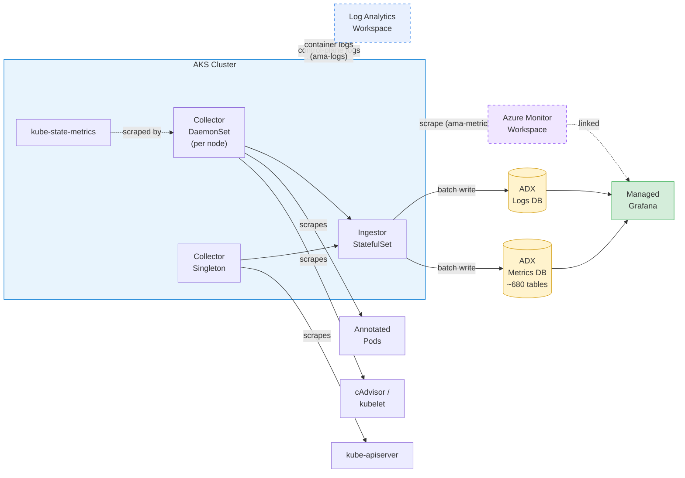
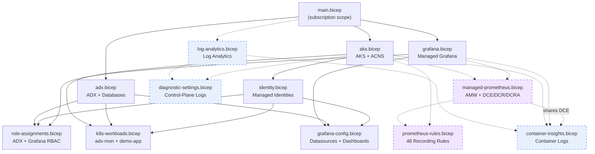

# adx-mon Bicep Demo

A single-command Bicep deployment of [adx-mon](https://github.com/Azure/adx-mon) on AKS.
adx-mon scrapes Prometheus-format metrics and container logs, stores them in
[Azure Data Explorer (ADX)](https://learn.microsoft.com/en-us/azure/data-explorer/), and
visualizes everything through [Managed Grafana](https://learn.microsoft.com/en-us/azure/managed-grafana/).

## Architecture



**Solid lines** = core ADX/Kusto pathway (implemented by adx-mon, always deployed).
**Dashed lines** = [Managed Prometheus](#managed-prometheus-enabled-by-default), [Diagnostic Settings](#aks-diagnostic-settings-enabled-by-default), and [Container Insights](#container-insights-enabled-by-default) — enabled by default but can be disabled.

Each Prometheus metric becomes its own table in the **Metrics** database (~680+ tables).
Logs land in tables created per [`log-destination` annotation](#logs-pod-annotations) in the
**Logs** database. System tables (`Collector`, `Ingestor`, `Kubelet`) are created automatically.

## Pathway Terminology Reference

Use **ADX/Kusto pathway** when describing the ADX data path. Use **adx-mon** for the collector/ingestor implementation that powers that pathway.

| Pathway name | Underlying tech name | Key terminology |
|---|---|---|
| ADX/Kusto pathway (via adx-mon) | Azure Data Explorer (ADX, Kusto engine) | Collector, Ingestor, Metrics DB, Logs DB, KQL |
| Managed Prometheus pathway | Azure Monitor Workspace (AMW) for Prometheus metrics | ama-metrics, DCE, DCR, DCRA, PromQL, recording rules |
| Geneva pathway (WIP) | Geneva data pipeline (MDM + MDSD) | StatsD, MetricsExtension, Fluentd, MDM, MDSD, warm path |

## Bicep Module Graph

`main.bicep` orchestrates 12 resource-group-scoped modules. **Solid lines** = always deployed.
**Dashed lines** = conditionally deployed (enabled by default, can be disabled).
AKS, ADX, and Grafana deploy in parallel; downstream modules wait for their dependencies.



## Quick Start

### Prerequisites

- [Azure CLI](https://learn.microsoft.com/en-us/cli/azure/install-azure-cli) with [Bicep](https://learn.microsoft.com/en-us/azure/azure-resource-manager/bicep/overview) (`az bicep install`)
- An Azure subscription with **Contributor** access

### 1. Configure Parameters

```bash
cp main.sample.bicepparam main.bicepparam
```

Edit `main.bicepparam` — at minimum you'll want to grant yourself
**ADX Viewer + Grafana Admin** access by adding your email (UPN).

```bicep
param userPrincipalNames = [
  'yourname@yourtenant.onmicrosoft.com'
]
```

The [Microsoft Graph Bicep extension](https://learn.microsoft.com/graph/templates/bicep/whats-new)
resolves email addresses to object IDs at deploy time — no need to look up GUIDs manually.
Each listed user gets **ADX Viewer** (on both Metrics and Logs databases) and **Grafana Admin**.

### 2. Deploy

```bash
az deployment sub create \
  --location eastus2 \
  --template-file main.bicep \
  --parameters main.bicepparam \
  --name adxmon-deploy
```

Deployment takes **~15 minutes** on a fresh deploy (ADX cluster provisioning is the bottleneck).
Update deploys (re-runs with parameter changes) take **~9 minutes**.

> **Tip**: Add `--no-wait` to return immediately and monitor via `az deployment sub show --name adxmon-deploy`.

### 3. Verify

```bash
az deployment sub show --name adxmon-deploy --query 'properties.outputs' -o json
```

This returns:

| Output | Use |
|--------|-----|
| `aksClusterName` | AKS cluster name (for `az aks get-credentials`) |
| `adxWebExplorerUrl` | Query metrics in the [ADX Web Explorer](https://learn.microsoft.com/en-us/azure/data-explorer/web-query-data) |
| `adxLogsExplorerUrl` | Query logs in the ADX Web Explorer |
| `adxClusterUri` | Programmatic access to ADX |
| `grafanaEndpoint` | Build dashboards (you have Grafana Admin) |
| `resourceGroupName` | Resource group containing all resources |
| `azureMonitorWorkspaceId` | AMW resource ID (present when Managed Prometheus is enabled) |
| `logAnalyticsPortalUrl` | Log Analytics query portal (present when Diagnostic Settings or Container Insights is enabled) |

### 4. Try It

The demo app responds on `http://demo-app/` inside the cluster. Generate traffic and watch
the dashboard update:

```bash
# Get cluster credentials
az aks get-credentials --resource-group rg-adx-mon --name aks-adx-mon

# Single request
kubectl run -it --rm curl --image=curlimages/curl --restart=Never -- curl -s http://demo-app/

# Load test — watch Request Rate spike on the dashboard
kubectl run -it --rm loadgen --image=curlimages/curl --restart=Never -- \
  sh -c 'for i in $(seq 1 100); do curl -s http://demo-app/ > /dev/null; done; echo Done'
```

Need steady background traffic without a redeploy? Apply the optional traffic generator:

```bash
kubectl apply -f k8s/demo-app-trafficgen.yaml

# Stop it later
kubectl delete -f k8s/demo-app-trafficgen.yaml
```

Open the Grafana dashboard (`grafanaEndpoint` output) to see request rate, CPU, and memory
respond in real time — side-by-side in ADX and Managed Prometheus.

## Finding Data

### Metrics

**Grafana Explore** — browse all metrics interactively with PromQL or KQL:

```bash
echo "$(az deployment sub show --name adxmon-deploy -o tsv --query properties.outputs.grafanaEndpoint.value)/explore"
```

**ADX Web Explorer** — query the Metrics database directly with KQL:

```bash
az deployment sub show --name adxmon-deploy -o tsv --query properties.outputs.adxWebExplorerUrl.value
```

### Logs

**Grafana Explore** — same URL as above, select the ADX datasource and switch to the **Logs** database.

**ADX Web Explorer** — query the Logs database directly:

```bash
az deployment sub show --name adxmon-deploy -o tsv --query properties.outputs.adxLogsExplorerUrl.value
```

**Log Analytics** (available when Diagnostic Settings or Container Insights is enabled — both are on by default):

```bash
az deployment sub show --name adxmon-deploy -o tsv --query properties.outputs.logAnalyticsPortalUrl.value
```

> Container Insights logs land in `ContainerLogV2`, `KubePodInventory`, and `KubeEvents` tables.
> AKS control-plane logs land in `AzureDiagnostics`.

### Sample KQL Queries

Once in the ADX Web Explorer, try:

```kusto
// List all metric tables
.show tables | sort by TableName

// Sample a metric
ContainerCpuUsageSecondsTotal
| where Timestamp > ago(5m)
| take 10

// Counter rate with prom_delta (auto-deployed by adx-mon)
ContainerCpuUsageSecondsTotal
| where Timestamp > ago(10m)
| invoke prom_delta()
| summarize avg(Value) by Namespace, bin(Timestamp, 1m)
```

> [`prom_delta()`](https://github.com/Azure/adx-mon) is a KQL function auto-deployed by adx-mon for computing Prometheus counter rates.

## Collecting Your Application Data

### Metrics (Pod Annotations)

Annotate your pod spec so the adx-mon Collector scrapes Prometheus metrics:

```yaml
annotations:
  adx-mon/scrape: "true"
  adx-mon/port: "8080"
  adx-mon/path: "/metrics"
```

You can also push metrics via [Prometheus remote write](https://prometheus.io/docs/concepts/remote_write_spec/) to the Collector at `:3100/receive`.

### Logs (Pod Annotations)

Route container logs to a custom ADX table:

```yaml
annotations:
  adx-mon/scrape: "true"               # required — gates ALL discovery
  adx-mon/log-destination: "Logs:MyAppTable"
  adx-mon/log-parsers: json
```

> **Important**: `adx-mon/scrape: "true"` is required for **both** metrics and log discovery.
> Without it, adx-mon will not discover the pod at all — even if `log-destination` is set.

> **System / unowned pods**: Pods without annotations (e.g., `kube-system`) can be patched with
> `kubectl patch` to add `adx-mon/scrape` + `adx-mon/log-destination`. This causes a rolling restart.
> See the [adx-mon configuration reference](https://github.com/Azure/adx-mon#configuration) for details.

## Managed Prometheus (enabled by default)

[Managed Prometheus](https://learn.microsoft.com/en-us/azure/azure-monitor/essentials/prometheus-metrics-overview)
can run **alongside** adx-mon — both scrape the same Prometheus endpoints independently.

To disable:
```bicep
param enableManagedPrometheus = false
param enableFullPrometheusMetrics = false
```

When enabled, Bicep deploys an [Azure Monitor Workspace (AMW)](https://learn.microsoft.com/en-us/azure/azure-monitor/essentials/azure-monitor-workspace-overview),
[data-collection endpoint/rule](https://learn.microsoft.com/en-us/azure/azure-monitor/essentials/data-collection-rule-overview), links the AMW to Grafana,
and creates [Prometheus recording rule groups](https://learn.microsoft.com/azure/azure-monitor/containers/prometheus-metrics-scrape-default#recording-rules)
required by the auto-provisioned Kubernetes Compute dashboards.
See `modules/prometheus-rules.bicep` for details on why these are declared explicitly.
Setting `enableFullPrometheusMetrics` additionally applies the [full metrics profile](https://learn.microsoft.com/en-us/azure/azure-monitor/containers/prometheus-metrics-scrape-default)
and pod-annotation scraping via [`ama-metrics-settings-configmap`](https://learn.microsoft.com/en-us/azure/azure-monitor/containers/prometheus-metrics-scrape-configuration).
This means custom app metrics (e.g., `nginx_http_requests_total`) appear in both ADX **and** Managed Prometheus — a true dual-pipeline.

See [COMPARISONS.md](COMPARISONS.md) for a detailed coverage comparison.

## AKS Diagnostic Settings (enabled by default)

Send AKS control-plane logs to a [Log Analytics workspace](https://learn.microsoft.com/en-us/azure/azure-monitor/logs/log-analytics-overview)
for audit and troubleshooting. [Microsoft recommends](https://learn.microsoft.com/en-us/azure/aks/monitor-aks#azure-monitor-resource-logs)
enabling this for all AKS clusters.

To disable:
```bicep
param enableDiagnosticSettings = false
```

When enabled, Bicep deploys a Log Analytics workspace and configures these categories:
[`kube-audit-admin`](https://learn.microsoft.com/en-us/azure/aks/monitor-aks-reference#resource-logs), `kube-controller-manager`, `cluster-autoscaler`, `guard`.

> **Cost note**: `kube-audit-admin` is used instead of `kube-audit` (full), which excludes
> GET/LIST requests and is [significantly cheaper](https://learn.microsoft.com/en-us/azure/aks/monitor-aks-reference#resource-logs).

## Container Insights (enabled by default)

[Container Insights](https://learn.microsoft.com/en-us/azure/azure-monitor/containers/container-insights-overview)
collects container logs and Kubernetes inventory data to a Log Analytics workspace — the log equivalent of what
[Managed Prometheus](#managed-prometheus-enabled-by-default) does for metrics.

To disable:
```bicep
param enableContainerInsights = false
```

When enabled, Bicep deploys a [data-collection rule/endpoint](https://learn.microsoft.com/en-us/azure/azure-monitor/essentials/data-collection-rule-overview),
enables the `omsagent` AKS addon (which deploys `ama-logs` DaemonSet pods), and grants Grafana read access to the workspace.

**Tables collected** (the "Logs and events" grouping):

| Table | Contents |
|-------|----------|
| `ContainerLogV2` | stdout/stderr from **all** containers (auto-discovered, no annotations needed) |
| `KubePodInventory` | Pod phase, image, conditions — structured inventory with no adx-mon equivalent |
| `KubeEvents` | Kubernetes events (scheduled, pulled, started, killed) |

**Namespace filtering**: `kube-system` is excluded to reduce noise. To capture specific `kube-system` workloads
(e.g., coredns), adjust the DCR's `namespaceFilteringMode` in `modules/container-insights.bicep`.

See [COMPARISONS.md](COMPARISONS.md) for a 3-way coverage comparison.

## Advanced Container Networking Services (ACNS)

[ACNS](https://learn.microsoft.com/azure/aks/advanced-container-networking-services-overview) is
always enabled. It provides network observability for AKS via Hubble/Cilium metrics. When Managed
Prometheus is also enabled, the auto-provisioned Kubernetes Networking dashboards in Grafana
populate with flow data automatically.

## Grafana Dashboards

A bundled **Demo App** dashboard is deployed automatically with panels arranged for side-by-side comparison:

| ADX/Kusto (via adx-mon) | Managed Prometheus | Container Insights |
|---|---|---|
| Request Rate (`NginxHttpRequestsTotal`) | Request Rate (`nginx_http_requests_total`) | — |
| Container CPU | Container CPU | — |
| Container Memory | — | Demo App Logs (`ContainerLogV2`) |
| Demo App Logs (ADX) | — | — |

The dashboard JSON lives in `dashboards/demo-app.json`. To add your own dashboards, pass
`dashboardDefinitions` — an array of `{ title, definition }` objects:

```bicep
param dashboardDefinitions = [
  {
    title: 'My Dashboard'
    definition: { /* Grafana JSON model */ }
  }
]
```

The deployment script calls `az grafana dashboard create` for each entry.

## Future: Geneva Integration

[Geneva](https://eng.ms/docs/products/geneva/getting_started/environments/akslinux) (Microsoft's internal monitoring platform) can coexist with adx-mon on the same AKS cluster. The ADX/Kusto pathway and Geneva pathway run independently and do not conflict.

| Signal | Geneva pathway details |
|--------|-------------|
| Metrics | StatsD → MetricsExtension → MDM, or Managed Prometheus pathway (ama-metrics → AMW) → MDM |
| Logs | stdout → Fluentd → MDSD → Geneva warm path |

Geneva agent deployment uses Kubernetes manifests (Helm/YAML), not Bicep. See the [Geneva on AKS guide](https://eng.ms/docs/products/geneva/getting_started/environments/akslinux) for setup.

## File Structure

```
├── main.bicep                    # Subscription-scope orchestrator
├── main.sample.bicepparam        # Sample parameters (copy → main.bicepparam)
├── bicepconfig.json              # Bicep linter config + Graph extension
├── dashboards/
│   └── demo-app.json             # Bundled Grafana dashboard (ADX vs Prometheus)
├── rules/
│   ├── node-recording-rules.json       # Node-level recording rules (11 rules)
│   ├── kubernetes-recording-rules.json # Kubernetes recording rules (19 rules)
│   └── ux-recording-rules.json         # UX recording rules (18 rules)
├── modules/
│   ├── aks.bicep                 # AKS with OIDC + workload identity + ACNS network observability
│   ├── adx.bicep                 # ADX cluster + Metrics/Logs databases (streaming ingestion)
│   ├── identity.bicep            # Managed identities + federated credentials
│   ├── grafana.bicep             # Managed Grafana workspace
│   ├── role-assignments.bicep    # ADX RBAC + Grafana Admin (adx-mon, Grafana, users)
│   ├── k8s-workloads.bicep       # Deployment script: applies K8s manifests
│   ├── grafana-config.bicep      # Deployment script: ADX datasource + dashboards
│   ├── managed-prometheus.bicep  # AMW, DCE, DCR, DCRA, Grafana link (can be disabled)
│   ├── prometheus-rules.bicep    # Prometheus recording rules for Kubernetes dashboards
│   ├── diagnostic-settings.bicep # AKS control-plane logs to LAW (can be disabled)
│   ├── container-insights.bicep  # Container logs + K8s inventory to LAW (can be disabled)
│   └── log-analytics.bicep       # Shared LAW (used by diagnostic-settings and container-insights)
└── k8s/
    ├── crds.yaml                 # adx-mon Custom Resource Definitions
    ├── ingestor.yaml             # Ingestor StatefulSet
    ├── collector.yaml            # Collector DaemonSet + Singleton
    ├── ksm.yaml                  # kube-state-metrics (auto-sharded)
    ├── demo-app.yaml             # nginx + exporter sidecar with dual-pipeline annotations
    ├── demo-app-trafficgen.yaml  # Optional semi-random traffic generator for demo-app
    ├── ama-metrics-settings.yaml # ConfigMap for Managed Prometheus scrape settings
    ├── functions.yaml            # Sample Function + ManagementCommand CRs
    └── sample-alertrule.yaml     # Sample AlertRule for pod restart detection
```

## Parameters

All parameters have sensible defaults. See `main.sample.bicepparam` for the full list. Key parameters:

| Parameter | Default | Description |
|-----------|---------|-------------|
| `location` | `eastus2` | Azure region for all resources |
| `resourceGroupName` | `rg-adx-mon` | Resource group name |
| `nodeVmSize` / `nodeCount` | `Standard_D4s_v3` / `2` | AKS node pool sizing |
| `adxSkuName` / `adxSkuCapacity` | `Standard_E2ads_v5` / `2` | ADX cluster sizing |
| `userPrincipalNames` | `[]` | UPN emails (e.g. `alias@tenant.onmicrosoft.com`) → ADX Viewer + Grafana Admin. Resolved via [Microsoft Graph extension](https://learn.microsoft.com/graph/templates/bicep/whats-new) |
| `enableManagedPrometheus` | `true` | Deploy Managed Prometheus alongside adx-mon ([details](#managed-prometheus-enabled-by-default)) |
| `enableFullPrometheusMetrics` | `true` | Full metrics profile + pod-annotation scraping ([details](#managed-prometheus-enabled-by-default)) |
| `enableDiagnosticSettings` | `true` | Send AKS control-plane logs to Log Analytics ([details](#aks-diagnostic-settings-enabled-by-default)) |
| `enableContainerInsights` | `true` | Collect container logs + K8s inventory via Container Insights ([details](#container-insights-enabled-by-default)) |
| `dashboardDefinitions` | `[]` | Grafana dashboard JSON definitions to provision ([details](#grafana-dashboards)) |

## Further Reading

- [adx-mon on GitHub](https://github.com/Azure/adx-mon) — source, configuration, and CRD reference
- [COMPARISONS.md](COMPARISONS.md) — adx-mon vs. Managed Prometheus vs. Container Insights coverage comparison
