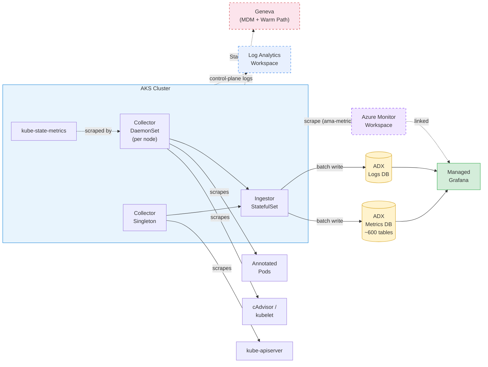

# adx-mon Bicep Demo

A single-command Bicep deployment of [adx-mon](https://github.com/Azure/adx-mon) on AKS.
adx-mon scrapes Prometheus-format metrics and container logs, stores them in
[Azure Data Explorer (ADX)](https://learn.microsoft.com/en-us/azure/data-explorer/), and
visualizes everything through [Managed Grafana](https://learn.microsoft.com/en-us/azure/managed-grafana/).

## Architecture



**Solid lines** = core adx-mon pipeline (always deployed).
**Dashed lines** = optional paths — [Managed Prometheus](#optional-managed-prometheus), [Diagnostic Settings](#optional-aks-diagnostic-settings), and [Geneva](#geneva-integration-1p-teams).

Each Prometheus metric becomes its own table in the **Metrics** database (~600+ tables).
Logs land in tables created per [`log-destination` annotation](#logs-pod-annotations) in the
**Logs** database. System tables (`Collector`, `Ingestor`, `Kubelet`) are created automatically.

## What Gets Deployed

| Resource | Purpose |
|----------|---------|
| **AKS Cluster** | Hosts adx-mon collectors, ingestor, and [kube-state-metrics](https://github.com/kubernetes/kube-state-metrics) |
| **Azure Data Explorer** | Stores metrics (~600+ auto-created tables) and logs (tables per annotation) |
| **Managed Grafana** | Visualization — ADX datasource is auto-configured |
| **Managed Identities** | [Workload identity](https://learn.microsoft.com/en-us/azure/aks/workload-identity-overview) federation — no secrets stored |
| **Managed Prometheus** *(optional)* | AMW + data-collection pipeline; set `enableManagedPrometheus = true` |
| **Diagnostic Settings** *(optional)* | Log Analytics workspace + AKS control-plane logs; set `enableDiagnosticSettings = true` |

## Quick Start

### Prerequisites

- [Azure CLI](https://learn.microsoft.com/en-us/cli/azure/install-azure-cli) with Bicep (`az bicep install`)
- An Azure subscription with **Contributor** access

### 1. Configure Parameters

```bash
cp main.sample.bicepparam main.bicepparam
```

Edit `main.bicepparam` — at minimum you'll want to grant yourself
**ADX Viewer + Grafana Admin** access by adding your principal ID.

#### Finding Your Principal ID

```bash
az ad signed-in-user show --query id -o tsv
```

Add the returned object ID to the parameter file:

```bicep
param userPrincipalIds = [
  '<your-object-id>'
]
```

For teams, store Azure AD **principal (object) IDs** in `~/ids.txt` — one per line:

```text
# ~/ids.txt — principal object IDs only (NOT tenant IDs)
aaaa1111-bb22-cc33-dd44-eeeeee000001   # teammate
aaaa1111-bb22-cc33-dd44-eeeeee000002   # you
```

> ⚠️ **Only principal object IDs go here.** Tenant IDs (e.g., `aaaa1111-…`) are *not* principals.

Each listed principal gets **ADX Viewer** (on both Metrics and Logs databases) and **Grafana Admin**.

#### Cross-tenant users

If principals belong to a different Azure AD tenant, also set
`userTenantId` (e.g., `param userTenantId = 'bbbb2222-…'`). When omitted it defaults to
the deploying subscription's tenant.

### 2. Deploy

```bash
az deployment sub create \
  --location eastus2 \
  --template-file main.bicep \
  --parameters main.bicepparam \
  --name adxmon-deploy
```

Deployment takes **~20 minutes** (ADX cluster provisioning is the bottleneck).

### 3. Verify

```bash
az deployment sub show --name adxmon-deploy --query 'properties.outputs' -o json
```

This returns:

| Output | Use |
|--------|-----|
| `aksClusterName` | AKS cluster name (for `az aks get-credentials`) |
| `adxWebExplorerUrl` | Query metrics / logs in the browser |
| `adxClusterUri` | Programmatic access to ADX |
| `grafanaEndpoint` | Build dashboards (you have Grafana Admin) |
| `resourceGroupName` | Resource group containing all resources |
| `azureMonitorWorkspaceId` | AMW resource ID (only when Managed Prometheus is enabled) |

### 4. Try It

The demo app responds on `http://demo-app/` inside the cluster. Generate traffic and watch
the dashboard update:

```bash
# Get cluster credentials
az aks get-credentials --resource-group rg-adx-mon --name aks-adx-mon

# Single request
kubectl run -it --rm curl --image=curlimages/curl --restart=Never -- curl -s http://demo-app/

# Load test — watch Request Rate spike on the dashboard
kubectl run -it --rm loadgen --image=curlimages/curl --restart=Never -- \
  sh -c 'for i in $(seq 1 100); do curl -s http://demo-app/ > /dev/null; done; echo Done'
```

Open the Grafana dashboard (`grafanaEndpoint` output) to see request rate, CPU, and memory
respond in real time — side-by-side in ADX and Managed Prometheus.

## Collecting Your Application Data

### Metrics (Pod Annotations)

Annotate your pod spec so the adx-mon Collector scrapes Prometheus metrics:

```yaml
annotations:
  adx-mon/scrape: "true"
  adx-mon/port: "8080"
  adx-mon/path: "/metrics"
```

You can also push metrics via [Prometheus remote write](https://prometheus.io/docs/concepts/remote_write_spec/) to the Collector at `:3100/receive`.

### Logs (Pod Annotations)

Route container logs to a custom ADX table:

```yaml
annotations:
  adx-mon/scrape: "true"               # required — gates ALL discovery
  adx-mon/log-destination: "Logs:MyAppTable"
  adx-mon/log-parsers: json
```

> **Important**: `adx-mon/scrape: "true"` is required for **both** metrics and log discovery.
> Without it, adx-mon will not discover the pod at all — even if `log-destination` is set.

### Collecting Logs from System / Unowned Pods

Pods you don't control (e.g., `kube-system`, managed add-ons) won't have adx-mon annotations.
To collect their logs, patch the pod template:

```bash
kubectl patch deployment <name> -n <namespace> --type merge -p '{
  "spec": {"template": {"metadata": {"annotations": {
    "adx-mon/scrape": "true",
    "adx-mon/log-destination": "Logs:<TableName>"
  }}}}}'
```

> This causes a rolling restart. There is no label/namespace-based discovery in adx-mon —
> annotation patching is the only mechanism. See the
> [adx-mon configuration reference](https://github.com/Azure/adx-mon#configuration) for all
> available annotations.

## Optional: Managed Prometheus

[Managed Prometheus](https://learn.microsoft.com/en-us/azure/azure-monitor/essentials/prometheus-metrics-overview)
can run **alongside** adx-mon — both scrape the same Prometheus endpoints independently.

```bicep
param enableManagedPrometheus = true
param enableFullPrometheusMetrics = true   // full scrape profile + pod-annotation scraping
```

When enabled, Bicep deploys an [Azure Monitor Workspace (AMW)](https://learn.microsoft.com/en-us/azure/azure-monitor/essentials/azure-monitor-workspace-overview),
data-collection endpoint/rule, and links the AMW to Grafana. Setting `enableFullPrometheusMetrics`
additionally applies the full metrics profile and pod-annotation scraping via
`ama-metrics-settings-configmap`, so custom app metrics (e.g., `nginx_http_requests_total`)
appear in both ADX **and** Managed Prometheus — a true dual-pipeline.

See [COMPARISONS.md](COMPARISONS.md) for a detailed coverage comparison.

## Optional: AKS Diagnostic Settings

Send AKS control-plane logs to a [Log Analytics workspace](https://learn.microsoft.com/en-us/azure/azure-monitor/logs/log-analytics-overview)
for audit and troubleshooting. [Microsoft recommends](https://learn.microsoft.com/en-us/azure/aks/monitor-aks#azure-monitor-resource-logs)
enabling this for all AKS clusters.

```bicep
param enableDiagnosticSettings = true
```

When enabled, Bicep deploys a Log Analytics workspace and configures these categories:
`kube-audit-admin`, `kube-controller-manager`, `cluster-autoscaler`, `guard`.

> **Cost note**: `kube-audit-admin` is used instead of `kube-audit` (full), which excludes
> GET/LIST requests and is [significantly cheaper](https://learn.microsoft.com/en-us/azure/aks/monitor-aks-reference#resource-logs).

## Grafana Dashboards

A bundled **Demo App** dashboard is deployed automatically with six panels arranged side-by-side:

| ADX (via adx-mon) | Managed Prometheus |
|---|---|
| Request Rate (`NginxHttpRequestsTotal`) | Request Rate (`nginx_http_requests_total`) |
| Container CPU | Container CPU |
| Container Memory | Demo App Logs |

The dashboard JSON lives in `dashboards/demo-app.json`. To add your own dashboards, pass
`dashboardDefinitions` — an array of `{ title, definition }` objects:

```bicep
param dashboardDefinitions = [
  {
    title: 'My Dashboard'
    definition: { /* Grafana JSON model */ }
  }
]
```

The deployment script calls `az grafana dashboard create` for each entry.

## Geneva Integration (1P Teams)

[Geneva](https://eng.ms/docs/products/geneva/getting_started/environments/akslinux) is Microsoft's
internal monitoring platform. It coexists with adx-mon on the same AKS cluster — each system runs
independent DaemonSets with no conflicts.

| Signal  | Geneva Path | How It Works |
|---------|-------------|--------------|
| Metrics | StatsD → [MetricsExtension](https://eng.ms/docs/products/geneva/collect/instrument/statsddaemon) → MDM | Apps emit StatsD on UDP 8125; MetricsExtension DaemonSet aggregates and publishes to Geneva MDM |
| Metrics | Prometheus → [Managed Prometheus](https://learn.microsoft.com/en-us/azure/azure-monitor/essentials/prometheus-metrics-overview) → MDM | AKS Managed Prometheus scrapes pods and remote-writes to an AMW backed by Geneva MDM |
| Logs    | stdout → Fluentd → [MDSD](https://eng.ms/docs/products/geneva/collect/references/agent/linuxmultitenant) → Geneva | Fluentd DaemonSet tails container logs and forwards to MDSD DaemonSet → Geneva warm path |

**Setup**: Geneva agent deployment uses Kubernetes manifests (Helm/YAML), not Bicep.
See the [Geneva on AKS guide](https://eng.ms/docs/products/geneva/getting_started/environments/akslinux)
and the [Geneva onboarding portal](https://portal.microsoftgeneva.com/account/onboard).

## Exploring the Data

### ADX Web Explorer

Open the `adxWebExplorerUrl` from deployment outputs, then try:

```kusto
// List all metric tables
.show tables | sort by TableName

// Sample a metric
ContainerCpuUsageSecondsTotal
| where Timestamp > ago(5m)
| take 10

// Counter rate with prom_delta
ContainerCpuUsageSecondsTotal
| where Timestamp > ago(10m)
| invoke prom_delta()
| summarize avg(Value) by Namespace, bin(Timestamp, 1m)
```

### Grafana

Navigate to the `grafanaEndpoint`, add panels using the pre-configured ADX datasource,
and query the **Metrics** or **Logs** database.

## File Structure

```
├── main.bicep                    # Subscription-scope orchestrator
├── main.sample.bicepparam        # Sample parameters (copy → main.bicepparam)
├── bicepconfig.json              # Bicep linter config
├── dashboards/
│   └── demo-app.json             # Bundled Grafana dashboard (ADX vs Prometheus)
├── modules/
│   ├── aks.bicep                 # AKS with OIDC + workload identity
│   ├── adx.bicep                 # ADX cluster + Metrics/Logs databases (streaming ingestion)
│   ├── identity.bicep            # Managed identities + federated credentials
│   ├── grafana.bicep             # Managed Grafana + user admin roles
│   ├── role-assignments.bicep    # ADX RBAC (adx-mon, Grafana, user viewers)
│   ├── k8s-workloads.bicep       # Deployment script: applies K8s manifests
│   ├── grafana-config.bicep      # Deployment script: ADX datasource + dashboards
│   ├── managed-prometheus.bicep  # Optional: AMW, DCE, DCR, DCRA
│   └── diagnostic-settings.bicep # Optional: LAW + AKS control-plane logs
└── k8s/
    ├── crds.yaml                 # adx-mon Custom Resource Definitions
    ├── ingestor.yaml             # Ingestor StatefulSet
    ├── collector.yaml            # Collector DaemonSet + Singleton
    ├── ksm.yaml                  # kube-state-metrics (auto-sharded)
    ├── demo-app.yaml             # nginx + exporter sidecar with dual-pipeline annotations
    ├── ama-metrics-settings.yaml # ConfigMap for Managed Prometheus scrape settings
    ├── functions.yaml            # Sample Function + ManagementCommand CRs
    └── sample-alertrule.yaml     # Sample AlertRule for pod restart detection
```

## Parameters

| Parameter | Default | Description |
|-----------|---------|-------------|
| `resourceGroupName` | `rg-adx-mon` | Resource group name |
| `location` | `eastus2` | Azure region |
| `aksClusterName` | `aks-adx-mon` | AKS cluster name |
| `adxClusterName` | auto-generated | ADX cluster name (lowercase alphanumeric, ≤ 22 chars) |
| `grafanaName` | `grafana-adx-mon` | Grafana workspace name |
| `nodeVmSize` | `Standard_D4s_v3` | VM size for AKS system node pool |
| `nodeCount` | `2` | Number of AKS nodes |
| `adxSkuName` | `Standard_E2ads_v5` | ADX compute SKU |
| `adxSkuCapacity` | `2` | ADX instance count |
| `userPrincipalIds` | `[]` | Azure AD **object IDs** → ADX Viewer + Grafana Admin |
| `userTenantId` | deploying tenant | Tenant for the listed principals ([cross-tenant](#cross-tenant-users)) |
| `enableManagedPrometheus` | `false` | Deploy Managed Prometheus alongside adx-mon |
| `enableFullPrometheusMetrics` | `false` | Full Prometheus metrics profile + pod-annotation scraping ([details](#optional-managed-prometheus)) |
| `enableDiagnosticSettings` | `false` | Send AKS control-plane logs to Log Analytics ([details](#optional-aks-diagnostic-settings)) |
| `dashboardDefinitions` | `[]` | Grafana dashboard JSON definitions to provision ([details](#grafana-dashboards)) |

## Further Reading

- [adx-mon on GitHub](https://github.com/Azure/adx-mon) — source, configuration, and CRD reference
- [COMPARISONS.md](COMPARISONS.md) — adx-mon vs. Managed Prometheus vs. Container Insights coverage comparison
