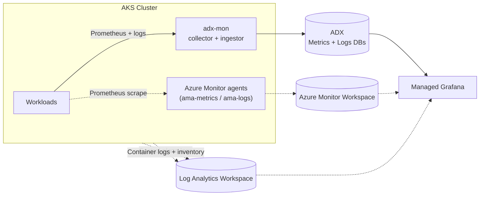

# adx-mon Bicep Demo

Deploy [adx-mon](https://github.com/Azure/adx-mon) on [Azure Kubernetes Service (AKS)](https://learn.microsoft.com/en-us/azure/aks/) with two observability pathways.
This demo is about viewing the same AKS workload signals through both pathways, then comparing in Grafana.

- **ADX/Kusto pathway**: adx-mon Collector/Ingestor writes metrics and logs to [Azure Data Explorer (ADX)](https://learn.microsoft.com/en-us/azure/data-explorer/).
- **Azure Monitor pathway**: AKS [Azure Monitor managed service for Prometheus](https://learn.microsoft.com/azure/azure-monitor/metrics/prometheus-metrics-overview) writes metrics to an [Azure Monitor Workspace](https://learn.microsoft.com/en-us/azure/azure-monitor/essentials/azure-monitor-workspace-overview) with alerting and [Azure Managed Grafana](https://learn.microsoft.com/azure/managed-grafana/overview) integration.

## Architecture



Solid lines are the ADX pathway. Dashed lines are Azure Monitor integrations (enabled by default, independently toggleable in `observability.bicep`).

## Repository Structure

- **`main.bicep`** (subscription scope): creates resource group + AKS, then invokes `observability.bicep`.
- **`observability.bicep`** (resource-group scope): orchestrates observability modules and exposes deployment outputs.
- **`modules/adx`**: ADX cluster/databases, identities, RBAC, and adx-mon Kubernetes workload deployment.
- **`modules/azure-monitor`**: Managed Prometheus, recording rules, metric alerts, diagnostic settings, and Container Insights.
- **`modules/grafana`**: Grafana provisioning, RBAC, datasource wiring, and dashboard provisioning.

## Quick Start

```bash
# 1) Copy parameters, set values in main.bicepparam, then deploy
cp main.sample.bicepparam main.bicepparam
az deployment sub create \
  --location eastus2 \
  --template-file main.bicep \
  --parameters main.bicepparam \
  --name adxmon-deploy

# 2) Read outputs (URLs, endpoints, IDs)
az deployment sub show --name adxmon-deploy --query 'properties.outputs' -o json

```

## Observability Pathways

### ADX

Implemented by [`modules/adx`](modules/adx): ADX cluster/databases, identities/RBAC, and adx-mon workload deployment.
Use `adxAlertDemoUrl` for the sample alert query deep link (`adxWebExplorerUrl` is the general ADX entry point).

### Azure Monitor

Implemented by [`modules/azure-monitor`](modules/azure-monitor): managed Prometheus collection, recording rules, [recommended (out-of-the-box) alert rules](https://learn.microsoft.com/azure/azure-monitor/containers/kubernetes-metric-alerts), [diagnostic settings](https://learn.microsoft.com/azure/azure-monitor/platform/diagnostic-settings), and [Container insights](https://learn.microsoft.com/azure/azure-monitor/containers/kubernetes-monitoring-overview).
AKS [Advanced Container Networking Services (ACNS) observability](https://learn.microsoft.com/azure/aks/advanced-container-networking-services-overview#container-network-observability) is enabled in [`modules/aks.bicep`](modules/aks.bicep) and contributes networking signals to the Azure Monitor pathway.

Use output `azureMonitorAlertPortalUrls[0]` for the Azure portal browse location of [Prometheus rule groups](https://learn.microsoft.com/azure/azure-monitor/metrics/prometheus-rule-groups).

Azure Monitor also includes these logs and inventory integrations:

- [`diagnostic-settings.bicep`](modules/azure-monitor/diagnostic-settings.bicep): AKS control-plane resource logs to a [Log Analytics workspace](https://learn.microsoft.com/azure/azure-monitor/logs/log-analytics-workspace-overview).
- [`container-insights.bicep`](modules/azure-monitor/container-insights.bicep): `ContainerLogV2`, `KubePodInventory`, `KubeEvents` via `ama-logs`.
- [`k8s/ama-metrics-settings.yaml`](k8s/ama-metrics-settings.yaml): metrics scrape profile (including baseline control-plane targets `controlplane-apiserver` and `controlplane-etcd`) and pod-annotation scraping settings used by Azure Monitor metrics collection.

#### Enabling More Data

Want more control-plane metrics? Review the available targets in [Customize control plane metrics in AKS](https://learn.microsoft.com/azure/aks/control-plane-metrics-monitor#customize-control-plane-metrics), then add the targets you want under `default-scrape-settings-enabled` in [`k8s/ama-metrics-settings.yaml`](k8s/ama-metrics-settings.yaml).

## Deployment Outputs (demo-first)

| Output | Use |
| --- | --- |
| `adxWebExplorerUrl` | ADX web UI entry point (queries + native dashboards) |
| `adxAlertDemoUrl` | ADX sample alert query deep link |
| `grafanaEndpoint` | Managed Grafana endpoint |
| `azureMonitorAlertPortalUrls[0]` | Azure portal browse URL for Prometheus rule groups |

Additional outputs are still available from `az deployment ... --query 'properties.outputs'`.

## ADX Dashboards (native)

- Open `adxWebExplorerUrl`, then use **Dashboards** in the ADX web UI.
- The ADX web UI includes a samples gallery with built-in dashboard examples.
- This deployment does not auto-provision a cluster-specific ADX dashboard pack in ADX.

## Grafana Dashboards

[`dashboards/demo-app.json`](dashboards/demo-app.json) is provisioned by default through [`modules/grafana/bind-adx-datasource.bicep`](modules/grafana/bind-adx-datasource.bicep).
When Managed Prometheus is enabled, deployment also imports Grafana gallery dashboards:
- [Kubernetes API Server dashboard](https://grafana.com/grafana/dashboards/20331-kubernetes-api-server/)
- [Kubernetes etcd dashboard](https://grafana.com/grafana/dashboards/20330-kubernetes-etcd/)

For additional dashboards, set `dashboardDefinitions` in [`observability.bicep`](observability.bicep).
