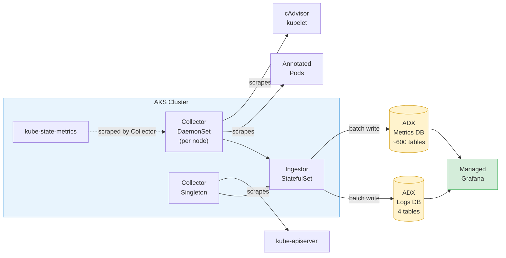

# adx-mon Bicep Demo

A single-command Bicep deployment of [adx-mon](https://github.com/Azure/adx-mon) on AKS — metrics and logs flow directly into [Azure Data Explorer](https://learn.microsoft.com/en-us/azure/data-explorer/) and are visualized through [Managed Grafana](https://learn.microsoft.com/en-us/azure/managed-grafana/).

## Architecture



[adx-mon](https://github.com/Azure/adx-mon) scrapes Prometheus-compatible endpoints and writes to ADX. Each Prometheus metric name becomes its own table in the **Metrics** database. Logs are written to four tables (`Collector`, `Ingestor`, `Kubelet`, `AdxmonIngestorTableDetails`) in the **Logs** database.

## What Gets Deployed

| Resource | Purpose |
|----------|---------|
| **AKS Cluster** | Hosts adx-mon collectors, ingestors, and [kube-state-metrics](https://github.com/kubernetes/kube-state-metrics) |
| **Azure Data Explorer** | Stores metrics (~600+ auto-created tables) and logs (4 tables) |
| **Managed Grafana** | Visualization with ADX datasource auto-configured |
| **Managed Identities** | [Workload identity](https://learn.microsoft.com/en-us/azure/aks/workload-identity-overview) federation — no secrets |

### Key Components

| Component | What It Does |
|-----------|-------------|
| **Collector DaemonSet** (per node) | Scrapes [cAdvisor](https://github.com/google/cadvisor), kubelet metrics, and annotated pods |
| **Collector Singleton** (1 replica) | Scrapes `kube-apiserver` for API request rates, latencies, etcd stats |
| **Ingestor StatefulSet** | Receives metrics from all collectors, batches, and writes to ADX |
| **kube-state-metrics** (sharded) | Exposes Kubernetes object state (pod phase, deployment replicas, node conditions) |

## Quick Start

### Prerequisites

- Azure CLI with Bicep (`az bicep install`)
- An Azure subscription with Contributor access

### 1. Configure Parameters

```bash
cp main.sample.bicepparam main.bicepparam
```

Edit `main.bicepparam` with your values. To grant yourself ADX Viewer + Grafana Admin access, add your Azure AD object ID:

```bash
# Find your principal ID
az ad signed-in-user show --query id -o tsv
```

Add it to the parameter file:

```bicep
param userPrincipalIds = [
  '<your-object-id>'
]
```

> **Tip:** For multiple users, keep principal IDs in a file (e.g., `~/ids.txt`) and reference them. If users are in a different tenant (e.g., TME), set `userTenantId` to that tenant's ID.

### 2. Deploy

```bash
az deployment sub create \
  --location eastus2 \
  --template-file main.bicep \
  --parameters main.bicepparam \
  --name adxmon-deploy
```

Deployment takes ~20 minutes (ADX cluster provisioning is the bottleneck).

### 3. Verify

```bash
# Get deployment outputs
az deployment sub show --name adxmon-deploy --query 'properties.outputs' -o json
```

This returns:
- **ADX Web Explorer URL** — query metrics/logs in the browser
- **Grafana Endpoint** — build dashboards (you have Grafana Admin)
- **ADX Cluster URI** — for programmatic access

## Collecting Your Application Data

### Metrics (Pod Annotations)

Add annotations to your pod spec to have adx-mon scrape Prometheus metrics:

```yaml
annotations:
  adx-mon/scrape: "true"
  adx-mon/port: "8080"
  adx-mon/path: "/metrics"
```

Alternatively, push metrics via [Prometheus remote write](https://prometheus.io/docs/concepts/remote_write_spec/) to the Collector at `:3100/receive`.

### Logs (Pod Annotations)

Route container logs to a custom ADX table:

```yaml
annotations:
  adx-mon/log-destination: "Logs:MyAppTable"
  adx-mon/log-parsers: json
```

## Optional: Managed Prometheus

[Managed Prometheus](https://learn.microsoft.com/en-us/azure/azure-monitor/essentials/prometheus-metrics-overview) can be enabled alongside adx-mon:

```bicep
param enableManagedPrometheus = true
```

This deploys an Azure Monitor Workspace (AMW), data collection endpoint/rule, and links the workspace to Grafana — providing out-of-the-box dashboards and alert rules. See [`modules/managed-prometheus.bicep`](modules/managed-prometheus.bicep) for details.

## Geneva Integration (1P Teams)

[Geneva](https://eng.ms/docs/cloud-ai-platform/azure-core/azure-cloud-native-and-management-platform/containers-bburns/azure-kubernetes-service/aks-for-first-party-customers/monitoring/index) is Microsoft's internal monitoring platform and can coexist with adx-mon on the same cluster. Metrics flow via Prom2MDM or StatsD to MDM; logs flow via the Geneva MA DaemonSet. Each system runs its own DaemonSet — no conflicts.

## Exploring the Data

### ADX Web Explorer

Open the ADX Web Explorer URL from deployment outputs, then try:

```kusto
// See all metric tables
.show tables | sort by TableName

// Sample a metric
ContainerCpuUsageSecondsTotal
| where Timestamp > ago(5m)
| take 10

// Use the prom_delta function for counter metrics
ContainerCpuUsageSecondsTotal
| where Timestamp > ago(10m)
| invoke prom_delta()
| summarize avg(Value) by Namespace, bin(Timestamp, 1m)
```

### Grafana

Navigate to the Grafana endpoint, add panels using the pre-configured ADX datasource, and query the `Metrics` or `Logs` database.

## File Structure

```
├── main.bicep                    # Subscription-scope orchestrator
├── main.sample.bicepparam        # Sample parameters (customize → main.bicepparam)
├── bicepconfig.json              # Bicep linter config
├── modules/
│   ├── aks.bicep                 # AKS with OIDC + workload identity
│   ├── adx.bicep                 # ADX cluster + Metrics/Logs databases
│   ├── identity.bicep            # Managed identities + federated credentials
│   ├── grafana.bicep             # Managed Grafana + user admin roles
│   ├── role-assignments.bicep    # ADX RBAC (adx-mon, Grafana, user viewers)
│   ├── k8s-workloads.bicep       # Deployment script: applies K8s manifests
│   ├── grafana-config.bicep      # Deployment script: ADX datasource only
│   └── managed-prometheus.bicep  # Optional: AMW, DCE, DCR, DCRA
└── k8s/
    ├── crds.yaml                 # adx-mon Custom Resource Definitions
    ├── ingestor.yaml             # Ingestor StatefulSet
    ├── collector.yaml            # Collector DaemonSet + Singleton
    ├── ksm.yaml                  # kube-state-metrics (auto-sharded)
    ├── functions.yaml            # Sample Function + ManagementCommand CRs
    └── sample-alertrule.yaml     # Sample AlertRule for pod restart detection
```

## Parameters

| Parameter | Default | Description |
|-----------|---------|-------------|
| `resourceGroupName` | `rg-adx-mon` | Resource group name |
| `location` | `eastus2` | Azure region |
| `aksClusterName` | `aks-adx-mon` | AKS cluster name |
| `grafanaName` | `grafana-adx-mon` | Grafana workspace name |
| `nodeVmSize` | `Standard_D4s_v3` | VM size for AKS system node pool |
| `nodeCount` | `2` | Number of AKS nodes |
| `adxSkuName` | `Standard_E2ads_v5` | ADX cluster SKU |
| `adxSkuCapacity` | `2` | ADX cluster instance count |
| `userPrincipalIds` | `[]` | Azure AD object IDs → ADX Viewer + Grafana Admin |
| `userTenantId` | current tenant | Tenant for user principals (override for cross-tenant) |
| `enableManagedPrometheus` | `false` | Deploy Managed Prometheus alongside adx-mon |

## Further Reading

- [adx-mon on GitHub](https://github.com/Azure/adx-mon) — source, configuration, and CRD reference
- [COMPARISONS.md](COMPARISONS.md) — detailed comparison of adx-mon vs. Managed Prometheus coverage
