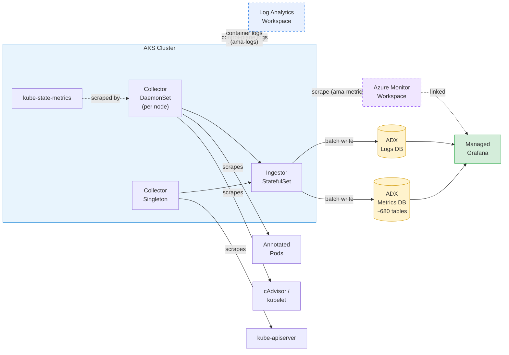
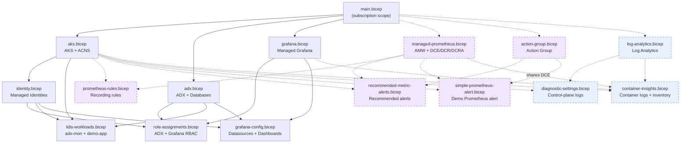

# adx-mon Bicep Demo

A single-command Bicep deployment of [adx-mon](https://github.com/Azure/adx-mon) on AKS.
adx-mon scrapes Prometheus-format metrics and container logs, stores them in
[Azure Data Explorer (ADX)](https://learn.microsoft.com/en-us/azure/data-explorer/), and
visualizes everything through [Managed Grafana](https://learn.microsoft.com/en-us/azure/managed-grafana/).

## Architecture



**Solid lines** = core ADX/Kusto pathway (implemented by adx-mon, always deployed).
**Dashed lines** = [Managed Prometheus](#managed-prometheus-enabled-by-default), [Diagnostic Settings](#aks-diagnostic-settings-enabled-by-default), and [Container Insights](#container-insights-enabled-by-default) — enabled by default but can be disabled.

Each Prometheus metric becomes its own table in the **Metrics** database (~680+ tables).
Logs land in tables created per [`log-destination` annotation](#logs-pod-annotations) in the
**Logs** database. System tables (`Collector`, `Ingestor`, `Kubelet`) are created automatically.

## Pathway Terminology Reference

Use **ADX/Kusto pathway** when describing the ADX data path. Use **adx-mon** for the collector/ingestor implementation that powers that pathway.

| Pathway name | Underlying tech name | Key terminology |
|---|---|---|
| ADX/Kusto pathway (via adx-mon) | Azure Data Explorer (ADX, Kusto engine) | Collector, Ingestor, Metrics DB, Logs DB, KQL |
| Managed Prometheus pathway | Azure Monitor Workspace (AMW) for Prometheus metrics | ama-metrics, DCE, DCR, DCRA, PromQL, recording rules |
| Geneva pathway (WIP) | Geneva data pipeline (MDM + MDSD) | StatsD, MetricsExtension, Fluentd, MDM, MDSD, warm path |

## Bicep Module Graph

`main.bicep` orchestrates the resource-group-scoped modules below. **Solid lines** = always deployed.
**Dashed lines** = conditionally deployed (enabled by default, can be disabled).
AKS, ADX, and Grafana deploy in parallel; downstream modules wait for their dependencies.



## Quick Start

### Prerequisites

- [Azure CLI](https://learn.microsoft.com/en-us/cli/azure/install-azure-cli) with [Bicep](https://learn.microsoft.com/en-us/azure/azure-resource-manager/bicep/overview) (`az bicep install`)
- An Azure subscription with **Contributor** access

### 1. Configure Parameters

```bash
cp main.sample.bicepparam main.bicepparam
```

Edit `main.bicepparam`:
- add your user UPN(s) for **ADX Viewer + Grafana Admin**
- set one or more **alert email receivers** for Azure Monitor alerts (Action Group is created by this deployment)
- set one or more **alert owner/contact identifiers**

```bicep
param userPrincipalNames = [
  'yourname@yourtenant.onmicrosoft.com'
]

param alertEmailReceivers = [
  {
    name: 'primary'
    emailAddress: 'yourname@yourtenant.onmicrosoft.com'
  }
]

param alertOwnerIds = [
  'youralias'
]
```

The [Microsoft Graph Bicep extension](https://learn.microsoft.com/graph/templates/bicep/whats-new)
resolves email addresses to object IDs at deploy time — no need to look up GUIDs manually.
Each listed user gets **ADX Viewer** (on both Metrics and Logs databases) and **Grafana Admin**.

### 2. Deploy

```bash
az deployment sub create \
  --location eastus2 \
  --template-file main.bicep \
  --parameters main.bicepparam \
  --name adxmon-deploy
```

Deployment takes **~15 minutes** on a fresh deploy (ADX cluster provisioning is the bottleneck).
Update deploys (no-change or parameter-only changes) take **~4–5 minutes** — deployment scripts
are skipped automatically when their inputs haven't changed.

> **Tip**: Add `--no-wait` to return immediately and monitor via `az deployment sub show --name adxmon-deploy`.

> **Force script re-execution**: If you need to reconcile out-of-band drift (e.g. someone manually
> edited K8s resources or Grafana dashboards), force both deployment scripts to re-run:
>
> ```bash
> az deployment sub create \
>   --location eastus2 \
>   --template-file main.bicep \
>   --parameters main.bicepparam \
>   --parameters forceScriptRerun=$(date -u +%Y%m%dT%H%M%SZ) \
>   --name adxmon-deploy
> ```

> **Faster iterative deploys** (Azure CLI 2.76+): Skip full RBAC preflight validation with
> `--validation-level ProviderNoRbac` to save a few seconds per deployment:
>
> ```bash
> az deployment sub create \
>   --location eastus2 \
>   --template-file main.bicep \
>   --parameters main.bicepparam \
>   --validation-level ProviderNoRbac \
>   --name adxmon-deploy
> ```

### 3. Verify

```bash
az deployment sub show --name adxmon-deploy --query 'properties.outputs' -o json
```

This returns:

| Output | Use |
|--------|-----|
| `aksClusterName` | AKS cluster name (for `az aks get-credentials`) |
| `adxWebExplorerUrl` | Query metrics in the [ADX Web Explorer](https://learn.microsoft.com/en-us/azure/data-explorer/web-query-data) |
| `adxLogsExplorerUrl` | Query logs in the ADX Web Explorer |
| `adxClusterUri` | Programmatic access to ADX |
| `grafanaEndpoint` | Build dashboards (you have Grafana Admin). Explore: append `/explore`. |
| `resourceGroupName` | Resource group containing all resources |
| `azureMonitorWorkspaceId` | AMW resource ID (present when Managed Prometheus is enabled) |
| `logAnalyticsPortalUrl` | Log Analytics query portal (present when Diagnostic Settings or Container Insights is enabled) |
| `recommendedMetricAlertRuleGroupNames` | Azure Monitor recommended AKS alert rule group names (when enabled) |
| `demoCustomAlertRuleGroupName` | Name of the simple custom Prometheus alert demo rule group |
| `alertLocation` | Azure region where alert rule groups are deployed |
| `azureMonitorAlertPortalUrls` | Direct Azure portal URLs for all Azure Monitor Prometheus alert rule groups |
| `adxMonSampleAlertRuleFile` | Repo path to the sample adx-mon AlertRule YAML |
| `adxMonSampleAlertKubectlCommand` | Command to inspect the deployed sample adx-mon AlertRule in AKS |

## Collecting Your Application Data

### Metrics (Pod Annotations)

Annotate your pod spec so the adx-mon Collector scrapes Prometheus metrics:

```yaml
annotations:
  adx-mon/scrape: "true"
  adx-mon/port: "8080"
  adx-mon/path: "/metrics"
```

You can also push metrics via [Prometheus remote write](https://prometheus.io/docs/concepts/remote_write_spec/) to the Collector at `:3100/receive`.

### Logs (Pod Annotations)

Route container logs to a custom ADX table:

```yaml
annotations:
  adx-mon/scrape: "true"               # required — gates ALL discovery
  adx-mon/log-destination: "Logs:MyAppTable"
  adx-mon/log-parsers: json
```

> **Important**: `adx-mon/scrape: "true"` is required for **both** metrics and log discovery.
> Without it, adx-mon will not discover the pod at all — even if `log-destination` is set.

> **System / unowned pods**: Pods without annotations (e.g., `kube-system`) can be patched with
> `kubectl patch` to add `adx-mon/scrape` + `adx-mon/log-destination`. This causes a rolling restart.
> See the [adx-mon configuration reference](https://github.com/Azure/adx-mon#configuration) for details.

## Managed Prometheus (enabled by default)

[Managed Prometheus](https://learn.microsoft.com/en-us/azure/azure-monitor/essentials/prometheus-metrics-overview)
can run **alongside** adx-mon — both scrape the same Prometheus endpoints independently.

To disable:
```bicep
param enableManagedPrometheus = false
```

When enabled, Bicep deploys an [Azure Monitor Workspace (AMW)](https://learn.microsoft.com/en-us/azure/azure-monitor/essentials/azure-monitor-workspace-overview),
[data-collection endpoint/rule](https://learn.microsoft.com/en-us/azure/azure-monitor/essentials/data-collection-rule-overview), links the AMW to Grafana,
and creates [Prometheus recording rule groups](https://learn.microsoft.com/azure/azure-monitor/containers/prometheus-metrics-scrape-default#recording-rules)
required by the auto-provisioned Kubernetes Compute dashboards.
See `modules/prometheus-rules.bicep` for details on why these are declared explicitly.

This deployment also enables Azure Monitor [recommended AKS metric alerts](https://learn.microsoft.com/en-us/azure/azure-monitor/containers/kubernetes-metric-alerts)
using Microsoft's published template and adds one simple custom Prometheus alert rule group as an example.

Log-based Azure Monitor alert rules (`scheduledQueryRules`) are intentionally out of scope in this repo.
This deployment applies the [full metrics profile](https://learn.microsoft.com/en-us/azure/azure-monitor/containers/prometheus-metrics-scrape-default)
and pod-annotation scraping via [`ama-metrics-settings-configmap`](https://learn.microsoft.com/en-us/azure/azure-monitor/containers/prometheus-metrics-scrape-configuration).
This means custom app metrics (e.g., `nginx_http_requests_total`) appear in both ADX **and** Managed Prometheus — a true dual-pipeline.

### Control plane metrics (preview)

AKS control plane metrics (for example `controlplane-apiserver` / `controlplane-etcd`) are a **preview** feature for the managed service for Prometheus.
Follow the official guide: [Monitor Azure Kubernetes Service control plane metrics (preview)](https://learn.microsoft.com/azure/aks/control-plane-metrics-monitor).

At a high level, you must:

```azurecli
# Install the aks-preview extension
az extension add --name aks-preview

# Register the feature flag
az feature register --namespace "Microsoft.ContainerService" --name "AzureMonitorMetricsControlPlanePreview"

# After it shows as Registered, refresh the provider registration
az provider register --namespace "Microsoft.ContainerService"
```

See [COMPARISONS.md](COMPARISONS.md) for a detailed coverage comparison.

## AKS Diagnostic Settings (enabled by default)

Send AKS control-plane logs to a [Log Analytics workspace](https://learn.microsoft.com/en-us/azure/azure-monitor/logs/log-analytics-overview)
for audit and troubleshooting. [Microsoft recommends](https://learn.microsoft.com/en-us/azure/aks/monitor-aks#azure-monitor-resource-logs)
enabling this for all AKS clusters.

To disable:
```bicep
param enableDiagnosticSettings = false
```

When enabled, Bicep deploys a Log Analytics workspace and configures these categories:
[`kube-audit-admin`](https://learn.microsoft.com/en-us/azure/aks/monitor-aks-reference#resource-logs), `kube-controller-manager`, `cluster-autoscaler`, `guard`.

> **Cost note**: `kube-audit-admin` is used instead of `kube-audit` (full), which excludes
> GET/LIST requests and is [significantly cheaper](https://learn.microsoft.com/en-us/azure/aks/monitor-aks-reference#resource-logs).

## Container Insights (enabled by default)

[Container Insights](https://learn.microsoft.com/en-us/azure/azure-monitor/containers/container-insights-overview)
collects container logs and Kubernetes inventory data to a Log Analytics workspace — the log equivalent of what
[Managed Prometheus](#managed-prometheus-enabled-by-default) does for metrics.

To disable:
```bicep
param enableContainerInsights = false
```

When enabled, Bicep deploys a [data-collection rule/endpoint](https://learn.microsoft.com/en-us/azure/azure-monitor/essentials/data-collection-rule-overview),
enables the `omsagent` AKS addon (which deploys `ama-logs` DaemonSet pods), and grants Grafana read access to the workspace.

**Tables collected** (the "Logs and events" grouping):

| Table | Contents |
|-------|----------|
| `ContainerLogV2` | stdout/stderr from **all** containers (auto-discovered, no annotations needed) |
| `KubePodInventory` | Pod phase, image, conditions — structured inventory with no adx-mon equivalent |
| `KubeEvents` | Kubernetes events (scheduled, pulled, started, killed) |

**Namespace filtering**: `kube-system` is excluded to reduce noise. To capture specific `kube-system` workloads
(e.g., coredns), adjust the DCR's `namespaceFilteringMode` in `modules/container-insights.bicep`.

See [COMPARISONS.md](COMPARISONS.md) for a 3-way coverage comparison.

## Advanced Container Networking Services (ACNS)

[ACNS](https://learn.microsoft.com/azure/aks/advanced-container-networking-services-overview) is
always enabled. It provides network observability for AKS via Hubble/Cilium metrics. When Managed
Prometheus is also enabled, the auto-provisioned Kubernetes Networking dashboards in Grafana
populate with flow data automatically.

## Grafana Dashboards

A bundled **Demo App** dashboard is deployed automatically with panels arranged for side-by-side comparison:

| ADX/Kusto (via adx-mon) | Managed Prometheus | Container Insights |
|---|---|---|
| Request Rate (`NginxHttpRequestsTotal`) | Request Rate (`nginx_http_requests_total`) | — |
| Container CPU | Container CPU | — |
| Container Memory | — | Demo App Logs (`ContainerLogV2`) |
| Demo App Logs (ADX) | — | — |

The dashboard JSON lives in `dashboards/demo-app.json`. To add your own dashboards, pass
`dashboardDefinitions` — an array of `{ title, definition }` objects:

```bicep
param dashboardDefinitions = [
  {
    title: 'My Dashboard'
    definition: { /* Grafana JSON model */ }
  }
]
```

The deployment script calls `az grafana dashboard create` for each entry.

## Future: Geneva Integration

[Geneva](https://eng.ms/docs/products/geneva/getting_started/environments/akslinux) (Microsoft's internal monitoring platform) can coexist with adx-mon on the same AKS cluster. The ADX/Kusto pathway and Geneva pathway run independently and do not conflict.

| Signal | Geneva pathway details |
|--------|-------------|
| Metrics | StatsD → MetricsExtension → MDM, or Managed Prometheus pathway (ama-metrics → AMW) → MDM |
| Logs | stdout → Fluentd → MDSD → Geneva warm path |

Geneva agent deployment uses Kubernetes manifests (Helm/YAML), not Bicep. See the [Geneva on AKS guide](https://eng.ms/docs/products/geneva/getting_started/environments/akslinux) for setup.

## Parameters

All parameters have sensible defaults. See `main.sample.bicepparam` for the full list. Key parameters:

| Parameter | Default | Description |
|-----------|---------|-------------|
| `location` | `eastus2` | Azure region for all resources |
| `resourceGroupName` | `rg-adx-mon` | Resource group name |
| `nodeVmSize` / `nodeCount` | `Standard_D4s_v3` / `2` | AKS node pool sizing |
| `adxSkuName` / `adxSkuCapacity` | `Standard_E2ads_v5` / `2` | ADX cluster sizing |
| `userPrincipalNames` | `[]` | UPN emails (e.g. `alias@tenant.onmicrosoft.com`) → ADX Viewer + Grafana Admin. Resolved via [Microsoft Graph extension](https://learn.microsoft.com/graph/templates/bicep/whats-new) |
| `enableManagedPrometheus` | `true` | Deploy Managed Prometheus alongside adx-mon (includes full metrics profile + recommended alerts) ([details](#managed-prometheus-enabled-by-default)) |
| `actionGroupName` | `ag-adx-mon` | Azure Monitor Action Group name used by alert rules |
| `alertEmailReceivers` | _required_ | Email receivers attached to the Action Group used by alert rules |
| `alertOwnerIds` | _required_ | Alert owner/contact identifiers used as metadata on custom demo alerts |
| `enableDiagnosticSettings` | `true` | Send AKS control-plane logs to Log Analytics ([details](#aks-diagnostic-settings-enabled-by-default)) |
| `enableContainerInsights` | `true` | Collect container logs + K8s inventory via Container Insights ([details](#container-insights-enabled-by-default)) |
| `dashboardDefinitions` | `[]` | Grafana dashboard JSON definitions to provision ([details](#grafana-dashboards)) |
| `forceScriptRerun` | `''` | Set to any unique value (e.g. a timestamp) to force deployment scripts to re-execute. Leave empty for normal idempotent behavior |

## Further Reading

- [adx-mon on GitHub](https://github.com/Azure/adx-mon) — source, configuration, and CRD reference
- [COMPARISONS.md](COMPARISONS.md) — adx-mon vs. Managed Prometheus vs. Container Insights coverage comparison
