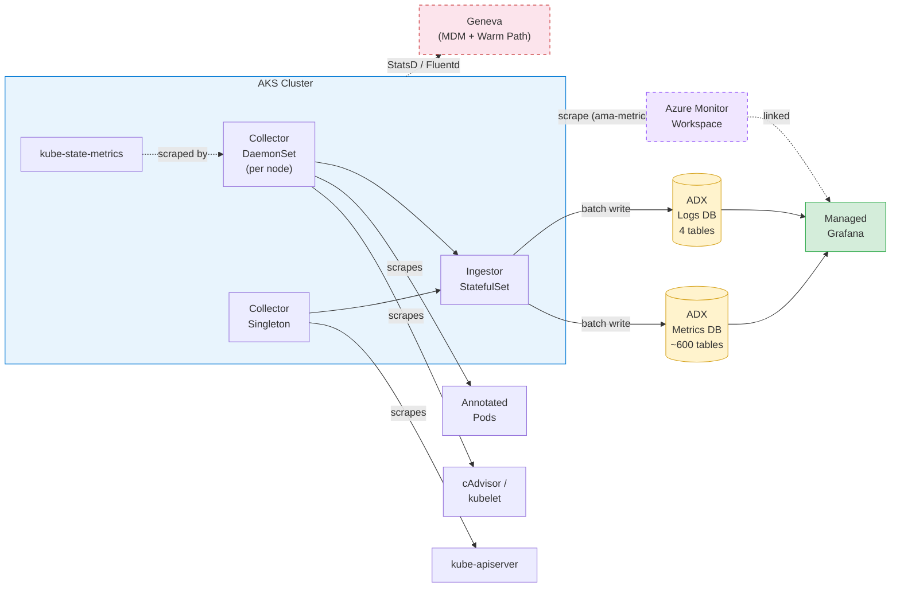

# adx-mon Bicep Demo

A single-command Bicep deployment of [adx-mon](https://github.com/Azure/adx-mon) on AKS.
adx-mon scrapes Prometheus-format metrics and container logs, stores them in
[Azure Data Explorer (ADX)](https://learn.microsoft.com/en-us/azure/data-explorer/), and
visualizes everything through [Managed Grafana](https://learn.microsoft.com/en-us/azure/managed-grafana/).

## Architecture



**Solid lines** = core adx-mon pipeline (always deployed).
**Dashed lines** = optional paths — [Managed Prometheus](#optional-managed-prometheus) and [Geneva](#geneva-integration-1p-teams).

Each Prometheus metric becomes its own table in the **Metrics** database (~600+ tables).
Logs land in four tables (`Collector`, `Ingestor`, `Kubelet`, `AdxmonIngestorTableDetails`)
in the **Logs** database.

## What Gets Deployed

| Resource | Purpose |
|----------|---------|
| **AKS Cluster** | Hosts adx-mon collectors, ingestor, and [kube-state-metrics](https://github.com/kubernetes/kube-state-metrics) |
| **Azure Data Explorer** | Stores metrics (~600+ auto-created tables) and logs (4 tables) |
| **Managed Grafana** | Visualization — ADX datasource is auto-configured |
| **Managed Identities** | [Workload identity](https://learn.microsoft.com/en-us/azure/aks/workload-identity-overview) federation — no secrets stored |
| **Managed Prometheus** *(optional)* | AMW + data-collection pipeline; set `enableManagedPrometheus = true` |

## Quick Start

### Prerequisites

- [Azure CLI](https://learn.microsoft.com/en-us/cli/azure/install-azure-cli) with Bicep (`az bicep install`)
- An Azure subscription with **Contributor** access

### 1. Configure Parameters

```bash
cp main.sample.bicepparam main.bicepparam
```

Edit `main.bicepparam` — at minimum you'll want to grant yourself
**ADX Viewer + Grafana Admin** access by adding your principal ID.

#### Finding Your Principal ID

```bash
az ad signed-in-user show --query id -o tsv
```

Add the returned object ID to the parameter file:

```bicep
param userPrincipalIds = [
  '<your-object-id>'
]
```

#### Granting Access to Multiple Users (`~/ids.txt`)

For teams, store Azure AD **principal (object) IDs** in a file — one per line:

```text
# ~/ids.txt — principal object IDs only (NOT tenant IDs)
1ece23ac-06a4-4ed0-afe2-dbb2e4f4980a   # teammate
e30b9b7c-44f7-432b-a95d-71fe0244e19b   # you
```

> ⚠️ **Only principal object IDs go in this file.** A tenant ID
> (e.g., `72f988bf-86f1-41af-91ab-2d7cd011db47`) is *not* a principal
> and must not be listed here.

Then reference it in the parameter file:

```bicep
param userPrincipalIds = [
  '1ece23ac-06a4-4ed0-afe2-dbb2e4f4980a'
  'e30b9b7c-44f7-432b-a95d-71fe0244e19b'
]
```

Each listed principal gets **ADX AllDatabasesViewer** and **Grafana Admin**.

#### Cross-Tenant Users (e.g., TME Tenant)

If your users belong to a different Azure AD tenant (common for TME,
tenant `70a036f6-8e4d-4615-bad6-149c02e7720d`), set `userTenantId`
so ADX creates the role assignments in the correct tenant:

```bicep
param userPrincipalIds = [
  'e30b9b7c-44f7-432b-a95d-71fe0244e19b'
]
param userTenantId = '70a036f6-8e4d-4615-bad6-149c02e7720d'
```

When `userTenantId` is omitted it defaults to the deploying subscription's
tenant — which is correct when all users are in the same tenant.

### 2. Deploy

```bash
az deployment sub create \
  --location eastus2 \
  --template-file main.bicep \
  --parameters main.bicepparam \
  --name adxmon-deploy
```

Deployment takes **~20 minutes** (ADX cluster provisioning is the bottleneck).

### 3. Verify

```bash
az deployment sub show --name adxmon-deploy --query 'properties.outputs' -o json
```

This returns:

| Output | Use |
|--------|-----|
| `adxWebExplorerUrl` | Query metrics / logs in the browser |
| `grafanaEndpoint` | Build dashboards (you have Grafana Admin) |
| `adxClusterUri` | Programmatic access to ADX |

## Collecting Your Application Data

### Metrics (Pod Annotations)

Annotate your pod spec so the adx-mon Collector scrapes Prometheus metrics:

```yaml
annotations:
  adx-mon/scrape: "true"
  adx-mon/port: "8080"
  adx-mon/path: "/metrics"
```

You can also push metrics via [Prometheus remote write](https://prometheus.io/docs/concepts/remote_write_spec/) to the Collector at `:3100/receive`.

### Logs (Pod Annotations)

Route container logs to a custom ADX table:

```yaml
annotations:
  adx-mon/log-destination: "Logs:MyAppTable"
  adx-mon/log-parsers: json
```

## Optional: Managed Prometheus

[Managed Prometheus](https://learn.microsoft.com/en-us/azure/azure-monitor/essentials/prometheus-metrics-overview)
can run **alongside** adx-mon — the two systems are independent and do not conflict.

```bicep
param enableManagedPrometheus = true
```

When enabled, Bicep deploys an [Azure Monitor Workspace (AMW)](https://learn.microsoft.com/en-us/azure/azure-monitor/essentials/azure-monitor-workspace-overview),
data-collection endpoint/rule, and links the AMW to Grafana.
This gives you Azure's built-in dashboards and alert rules in addition to the adx-mon pipeline.
See [`modules/managed-prometheus.bicep`](modules/managed-prometheus.bicep) for implementation details
and [COMPARISONS.md](COMPARISONS.md) for a detailed coverage comparison.

## Geneva Integration (1P Teams)

[Geneva](https://eng.ms/docs/products/geneva/getting_started/environments/akslinux) is Microsoft's
internal monitoring platform. It coexists with adx-mon on the same AKS cluster — each system runs
independent DaemonSets with no conflicts.

| Signal  | Geneva Path | How It Works |
|---------|-------------|--------------|
| Metrics | StatsD → [MetricsExtension](https://eng.ms/docs/products/geneva/collect/instrument/statsddaemon) → MDM | Apps emit StatsD on UDP 8125; MetricsExtension DaemonSet aggregates and publishes to Geneva MDM |
| Metrics | Prometheus → [Managed Prometheus](https://learn.microsoft.com/en-us/azure/azure-monitor/essentials/prometheus-metrics-overview) → MDM | AKS Managed Prometheus scrapes pods and remote-writes to an AMW backed by Geneva MDM |
| Logs    | stdout → Fluentd → [MDSD](https://eng.ms/docs/products/geneva/collect/references/agent/linuxmultitenant) → Geneva | Fluentd DaemonSet tails container logs and forwards to MDSD DaemonSet → Geneva warm path |

**Setup**: Geneva agent deployment uses Kubernetes manifests (Helm/YAML), not Bicep.
See the [Geneva on AKS guide](https://eng.ms/docs/products/geneva/getting_started/environments/akslinux)
and the [Geneva onboarding portal](https://portal.microsoftgeneva.com/account/onboard).

## Exploring the Data

### ADX Web Explorer

Open the `adxWebExplorerUrl` from deployment outputs, then try:

```kusto
// List all metric tables
.show tables | sort by TableName

// Sample a metric
ContainerCpuUsageSecondsTotal
| where Timestamp > ago(5m)
| take 10

// Counter rate with prom_delta
ContainerCpuUsageSecondsTotal
| where Timestamp > ago(10m)
| invoke prom_delta()
| summarize avg(Value) by Namespace, bin(Timestamp, 1m)
```

### Grafana

Navigate to the `grafanaEndpoint`, add panels using the pre-configured ADX datasource,
and query the **Metrics** or **Logs** database.

## File Structure

```
├── main.bicep                    # Subscription-scope orchestrator
├── main.sample.bicepparam        # Sample parameters (copy → main.bicepparam)
├── bicepconfig.json              # Bicep linter config
├── modules/
│   ├── aks.bicep                 # AKS with OIDC + workload identity
│   ├── adx.bicep                 # ADX cluster + Metrics/Logs databases
│   ├── identity.bicep            # Managed identities + federated credentials
│   ├── grafana.bicep             # Managed Grafana + user admin roles
│   ├── role-assignments.bicep    # ADX RBAC (adx-mon, Grafana, user viewers)
│   ├── k8s-workloads.bicep       # Deployment script: applies K8s manifests
│   ├── grafana-config.bicep      # Deployment script: ADX datasource setup
│   └── managed-prometheus.bicep  # Optional: AMW, DCE, DCR, DCRA
└── k8s/
    ├── crds.yaml                 # adx-mon Custom Resource Definitions
    ├── ingestor.yaml             # Ingestor StatefulSet
    ├── collector.yaml            # Collector DaemonSet + Singleton
    ├── ksm.yaml                  # kube-state-metrics (auto-sharded)
    ├── functions.yaml            # Sample Function + ManagementCommand CRs
    └── sample-alertrule.yaml     # Sample AlertRule for pod restart detection
```

## Parameters

| Parameter | Default | Description |
|-----------|---------|-------------|
| `resourceGroupName` | `rg-adx-mon` | Resource group name |
| `location` | `eastus2` | Azure region |
| `aksClusterName` | `aks-adx-mon` | AKS cluster name |
| `adxClusterName` | auto-generated | ADX cluster name (lowercase alphanumeric, ≤ 22 chars) |
| `grafanaName` | `grafana-adx-mon` | Grafana workspace name |
| `nodeVmSize` | `Standard_D4s_v3` | VM size for AKS system node pool |
| `nodeCount` | `2` | Number of AKS nodes |
| `adxSkuName` | `Standard_E2ads_v5` | ADX compute SKU |
| `adxSkuCapacity` | `2` | ADX instance count |
| `userPrincipalIds` | `[]` | Azure AD **object IDs** → ADX Viewer + Grafana Admin |
| `userTenantId` | deploying tenant | Tenant for the listed principals ([cross-tenant](#cross-tenant-users-eg-tme-tenant)) |
| `enableManagedPrometheus` | `false` | Deploy Managed Prometheus alongside adx-mon |

## Further Reading

- [adx-mon on GitHub](https://github.com/Azure/adx-mon) — source, configuration, and CRD reference
- [COMPARISONS.md](COMPARISONS.md) — adx-mon vs. Managed Prometheus vs. Container Insights coverage comparison
